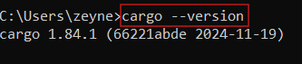

# Rust Gün 1:

# Rust Nedir?

- Rust bir sistem programlama dilidir. Hatta modern sistem programlama dillerinin en popüler örneklerinden biridir.
- Sistem programlama, genellikle düşük seviyeli ve orta seviyeli dilleri (Assembly, C, C++, Rust, D) kullanır. Amaç, donanım kaynaklarına doğrudan erişmek, performansı optimize etmek ve işletim sistemleri, aygıt sürücüleri gibi temel sistem yazılımlarını geliştirmektir. Yüksek seviyeli diller (Python, Java, C#), genellikle sistem programlama için uygun değildir çünkü donanım üzerinde yeterli kontrol sağlamazlar ve performansları genellikle daha düşüktür.

---

# Neden Rust Öğrenmeliyiz?

- Rust; modern, güvenli ve performanslı bir sistem programlama dili öğrenmek isteyen herkes için harika bir seçenektir. Bellek güvenliği, eşzamanlılık, düşük seviyeli kontrol ve modern dil tasarımı gibi özellikleri, Rust'ı sistem programlama alanında rekabetçi bir seçenek yapar. Eğer sistem programlama, gömülü sistemler, işletim sistemleri veya yüksek performanslı uygulamalarla ilgileniyorsanız, Rust'ı öğrenmek sizin için değerli bir yatırım olabilir.

## Rust’ın Önemli Özellikleri:

1. ***Bellek Güvenliği ve Hata Önleme:*** 
    
    Sistem programlama dillerinde en büyük zorluklardan biri bellek yönetimidir. C ve C++ gibi dillerde null pointer'lar, dangling pointer'lar ve veri yarışları gibi hatalar çok yaygındır ve debugging süreci oldukça zor olabilir. Rust'ın sahiplik ve ödünç alma (borrowing) sistemi, bu tür hataları derleme zamanında yakalar, yani kodunuzu çalıştırmadan önce hataları düzeltme fırsatınız olur. Bu, daha güvenilir ve sağlam yazılımlar geliştirmenizi sağlar.
    
2. ***Yüksek Performans:***
    
    Rust, sıfır maliyetli soyutlamalar prensibini benimser. Bu, yüksek seviyeli programlama kolaylıklarını sunarken, performanstan ödün vermediği anlamına gelir. Rust kodu, C ve C++ koduna yakın bir performansa sahiptir. Bu nedenle, performansın kritik olduğu sistem programlama uygulamalarında çok iyi bir seçenektir.
    
3. ***Eşzamanlılık:***
    
    Rust, eşzamanlı programlama için güçlü araçlar sunar. Ownership sistemi, veri yarışlarını önlemeye yardımcı olur ve güvenli eşzamanlı kod yazmanızı kolaylaştırır. Modern uygulamalar giderek daha çok çekirdekli işlemcilerden yararlanmaya çalıştığı için, eşzamanlılık yetenekleri Rust'ın güçlü yanlarını ortaya çıkartır.
    
4. ***Düşük Seviyeli Kontrol:***
    
    Rust, donanım kaynakları üzerinde düşük seviyeli kontrol sağlar. Bu, işletim sistemleri, aygıt sürücüleri ve gömülü sistemler gibi düşük seviyeli yazılımlar geliştirmeniz gerektiğinde çok önemlidir. Aynı zamanda, bellek düzenini ve diğer düşük seviyeli detayları kontrol edebilmeniz, performansı daha da optimize etmenizi sağlar.
    
5. ***Modern Dil Tasarımı:***
    
    Rust, modern programlama kavramlarını ve özelliklerini içerir. Bu, daha temiz, okunabilir ve bakımı kolay kod yazmanıza yardımcı olur. Ayrıca, Rust'ın güçlü tip sistemi ve pattern matching gibi özellikleri, kodunuzu daha güvenli ve hatasız hale getirir.
    
6. ***Gelişen Topluluk ve Ekosistem:***
    
    Rust, aktif ve büyüyen bir topluluğa sahiptir. Bu, yardım bulmanın ve projeleriniz için kütüphaneler ve araçlar bulmanın kolay olduğu anlamına gelir. Ayrıca, Rust'ın Cargo paket yöneticisi, bağımlılıkları yönetmeyi ve projeleri oluşturmayı kolaylaştırır.
    
7. ***Sistem Programlama Alanında Artan Popülarite:***
    
    Rust, sistem programlama alanında giderek daha popüler hale geliyor bu da Rust bilen geliştiricilere olan talebin artacağı anlamına gelir.
    

 Sonuç olarak; modern, güvenli ve performanslı bir sistem programlama dili olan Rust’ı öğrenmek ve projeler geliştirmek istyorsanız bu github reposunu takip edin ve 30 günlük bir program ile basic düzeyde Rust öğrenerek uygulamalar geliştirmeye başlayın.

---

# Rust Öğrenmek İçin Gerekli Kaynaklar:

- Rust Programlama dilini en iyi öğrenebileceğimiz kaynak tabii ki de resmi websitesi :  [https://www.rust-lang.org/learn](https://www.rust-lang.org/learn)

💡 *Not:  Bu websitesi’nin anasayfasındaki [Playground](https://play.rust-lang.org/) sekmesi ile Rust’ı bilgisayara kurmadan tarayıcıdan kullanabilirsiniz.*

---

# Kurulum:

- Websitesinde bulunan install butonuyla kurulum için gerekli işlemlerin olduğu sayfaya geçebilirsiniz. Bu sayfada aşağıda görüldüğü gibi Rustup’ın tavsiye edilen ayarlarında Visual Studio C++ araçlarını bilgisayara yüklememiz gerekiyor öncelikle.

- Aşağıdaki Download Build Tools butonuna tıkladığımızda [**vs_BuildTools.exe](https://download.visualstudio.microsoft.com/download/pr/9e5046bb-ab15-4a45-9546-cbabed333482/e44275c738c3b146c1acbf6fadd059ff9567ce97113cc584886cdc6985bfe538/vs_BuildTools.exe) dosyasını indirecektir. Bu dosyaya tıklayarak Visual Studio Installer kurulumu yapalım.

- Kurlumdan sonra karşımıza çıkan ekranda C++ ile masaüstü geliştirme seçeneğini indirmemiz gerekiyor.

💡 *Not:  Rust’ı Windows'ta **local olarak** kullanabilmek için **Microsoft C++ Build Tools**'u indirmemizin nedeni, Rust'ın **bazı bileşenlerinin C ve C++ bağımlılıkları** içermesidir. Özellikle **Rust’un Cargo paketi yöneticisiyle** bazı bağımlılıkları derlerken C derleyicisine ihtiyaç duyarız. Rust’ın kendi **Rustc derleyicisi** zaten bağımsızdır ve çoğu Rust kodunu çalıştırmak için ek bir derleyici gerektirmez ancak Rust’ın bazı parçaları **C dilinde yazılmış kodlara** sahiptir. Örneğin, `std` kütüphanesi kısmen C kodlarını içerir ve bunları derlemek için bir C derleyicisine ihtiyaç duyar. Ya da, **`cc` `crate`** veya **`bindgen` gibi araçlar**, arka planda bir C derleyicisi kullanır. Ek olarak, **Rust’ın resmi paket yöneticisi** `cargo` bazı paketleri indirirken, özellikle **native (yerel) kod içeren paketleri** derlerken **C/C++ derleyicisine** ihtiyaç duyabilir. Özetle, eğer **Rust’ı tamamen bağımsız (bare-metal) bir ortamda** çalıştırmıyorsanız, bazı Rust projelerinin **MSVC (Microsoft Visual C++) toolchain** ile derlenmesi gerekebilir.*

## Windows Kurulumu:

- Daha sonra bilgisayarınızın işletim sistemi hangi bite uygunsa onu seçip indirmeniz gerekir. (Benim bilgisayarım 64-BIT olduğu için onu seçtim.)

- İndirdiğimiz exe dosyasını açınca terminalde aşağıdaki seçenek çıkıyor. Buradan default kurulumu yapmak için 1’i seçip klavyede enter’a basmalıyız.

### **Rustup Yükleme:**

**Rustup** yüklediğinizde aşağıdaki üç önemli bileşen **otomatik olarak** gelir:

1. **Rustc (Rust derleyicisi)**
2. **Cargo (Paket yöneticisi ve proje yönetim aracı)**
3. **Rustup (Rust sürüm yöneticisi)**

- Rust compalier’in kurulu olup olmadığını öğrenmek için yeni bir terminalde aşağıdaki komutu çalıştırdım. Bu sayede yüklemiş olduğumuz versiyonu da görebiliriz.
    
    
    
- **Cargo**, **Rust’ın resmi paket yöneticisi** ve **proje yönetim aracıdır**. Rust projelerini oluşturmak, bağımlılıkları yönetmek, kodu derlemek ve çalıştırmak gibi işlemleri yapmamızı sağlar. Aşağıdaki kodla cargo paket yöneticisinin de versiyonunu da öğrenebiliriz.
    
    
    
- Sonuç olarak;  **Rustup** yüklediğinizde aşağıdaki üç önemli bileşen **otomatik olarak** gelir.

---

# **Rust Kullanımı İçin** Editör Kurulumu :

Ben Rust’ı kullanmak için Visual Studio Code editörünü indirdim. Siz dilerseniz başka IDE’ler ve editörler kullanabilirsiniz. Bunlar; JetBrains CLion, yine bir JetBrains ürünü olan IntelliJ IDEA,  Neovim / Vim, Sublime Text olabilir.

💡 *Not:*  *Eğer üniversite öğrencisiyseniz ve [edu.tr](http://edu.tr) uzantılı mail adresiniz varsa JetBrains IDE’lerinin tam sürümlerini ücretsiz olarak kullanabilirsiniz.*

---

- Yukarıdaki Download butonu ile basit bir şekilde kurulum yaptıktan sonra extensions sekmesinden Rust-analyzer uzantısını yükleyin. Bu yüklemesi zorunlu bir uzantıdır ve **"rust-analyzer" uzantısı** sayesinde Visual Studio Code otomatik tamamlamayla hata denetleme desteğini sunar.

---

## Tercihe Bağlı Eklenebilecek Extension’lar:

### Even Better TOML :

- Cargo bağımlılıklarını daha iyi düzenlemenizi sağlar. `Cargo.toml` dosyasındaki **TOML sözdizimini (syntax) renklendirir ve hata denetimi yapar.**

### CodeLLDB :

- **Hata ayıklama (debugging) desteği sağlar. Debug işlemlerini başlatmak için F5 tuşuna basmanız gerekir.**
- **Breakpoints, değişken görüntüleme, adım adım çalıştırma gibi özellikler ekler.**
- **LLDB tabanlıdır** ve Rust’a özel hata ayıklama desteği içerir. LLDB, **C, C++, Rust ve Swift gibi diller için geliştirilmiş** modern ve güçlü bir hata ayıklayıcıdır.  LLVM ekibi tarafından geliştirilmiştir ve Xcode, Android NDK gibi birçok sistemde kullanılır.

### Run Test Lens:

- Rust projelerinde **testleri doğrudan VS Code üzerinden çalıştırmaya** yarar.
- #[test] etiketli fonksiyonların yanında **"Run Test"** butonu gösterir.
- **Unit test yazanlar için büyük kolaylık sağlar.**

---

# **Temel Cargo Komutları ve İşlevleri**

1. **`cargo new`**
    - **Yeni proje oluşturur.**
    - Örnek: `cargo new proje_adi` → `src` klasörü, `Cargo.toml` (bağımlılık ve proje ayarları) otomatik oluşturulur.
2. **`cargo build`**
    - **Projeyi derler.**
    - **Debug modunda** çalışır (hızlı derleme, optimizasyon yok).
    - Çalıştırılabilir dosyayı `target/debug/` klasörüne kaydeder.
    - İlk çalıştırmada `Cargo.lock` dosyası oluşturur (bağımlılık versiyonlarını takip eder, elle düzenlenmez).
3. **`cargo run`**
    - **Derler ve çalıştırır (tek komut).**
    - Dosyalar değişmemişse direkt çalıştırır; değişmişse önce derler.
4. **`cargo check`**
    - **Kodu derlemeden kontrol eder (hata arar).**
    - Executable (çalıştırılabilir dosya) oluşturmaz → **çok hızlıdır.**
    - Kod yazarken sık sık kullanılması önerilir.

---

### **Release Build (Üretim için Derleme)**

- **`cargo build --release`**
    - Optimizasyonlarla derleme yapar (yavaş derleme, hızlı çalışan kod).
    - Çalıştırılabilir dosya `target/release/` klasörüne kaydedilir.
    - Release modu, optimizasyonları etkinleştirir ve hata ayıklama bilgilerini çıkarır, bu da daha hızlı ve daha küçük bir çalıştırılabilir dosya üretir.
    - Son ürün dağıtılacaksa veya performans testi yapılacaksa kullanılır.
    

---

# Cargo ile Proje Oluşturma:

- Rust’ta yeni proje oluşturmak ve projedeki bağımlılıkları yönetmek için cargo’yu kullanırız.
- Öncelikle bir klasör oluşturup bu klasörü VS Code’da açalım
- Daha sonra bir VS Code içerisinde bir terminal açarak ilk komutu girelim.
- Aşağıdaki kodda,  `cargo new` ile introduction_project adında yeni bir proje oluşturdum. Bu proje dosyasının içine de **`src/`**  klasörünü ve **`Cargo.toml`**  dosyasını otomatik olarak eklenir.

`Cargo.toml`**: P**roje ayarlarını ve bağımlılıklarını içeren bir yapılandırma dosyasıdır.

- **`src/`** klasörü altında `main.rs` dosyası otomatik olarak oluşur. main.rs dosyası, kodlarımızı yazdığımız ve  `cargo run` ile çalıştırdığımız dosyadır.
- Projeyi derlemek için  `cargo build` komutunu çalıştırırız. İlk kez `cargo build` çalıştırıldığında **`target/`** klasörüyle `Cargo.lock` dosyası oluşturulur ve bağımlılıklar bu dosyaya kaydedilir.

***💡 Not: Eğer bağımlılık sürümlerini güncellemek isterseniz, `cargo update` komutunu kullanabilirsiniz.***

 

- **`target/` klasörü**, Cargo'nun **derlenmiş (compiled) dosyaları sakladığı dizindir**.
- Derleme tamamlandıktan sonra **`target/`** dizininin içinde aşağıdaki alt klasörler oluşur:

| **Klasör/ Dosya** | **Açıklama** |
| --- | --- |
| **`debug/`** | Default olarak oluşturulan **debug modundaki derlenmiş dosyalar** burada saklanır. (Optimizasyon yoktur, hızlı derlenir.) |
| **`release/`** | **`cargo build --release`** ile çalıştırıldığında, **optimize edilmiş derlenmiş dosyalar** burada saklanır. |
| **`incremental/`** | **Artımlı derleme (incremental compilation)** için kullanılan geçici dosyalar burada saklanır. |
| **`deps/`** | **Proje bağımlılıklarının derlenmiş sürümleri** burada saklanır. (Yeniden derlemeyi önler ve hızı artırır.) |
| **`.fingerprint/`** | Derleme durumu hakkında bilgileri saklayan dosyalar içerir. (Hangi dosyaların değiştiğini takip eder.) |

***💡 Not:  Eğer projeyi temizlemek isterseniz** 🧹 **`cargo clean`** komutunu çalıştırarak* **`target/`** *klasörünü silebilirsiniz. Ancak,* `Cargo.lock` *dosyası silinmez.*

- Aşağıda, **`main.rs`** dosyası ile ilk kodumu yazdım (bu kod projeyi build ettiğimizde default olarak gelir). Terminalde **`cargo run` komutu ile birlikte çalıştırdım ve terminalde *“**Hello, World!”* **çıktısını aldım.**

 🥳 Harika bir şekilde birinci günümüzü tamamlayarak *Hello, World!*  çıktımızı aldık. 

---

[Day 2](https://github.com/zeyneptass/30-Days-Of-Rust/blob/main/Rust_Tutorial_Day_2/RustDay2.md) >>