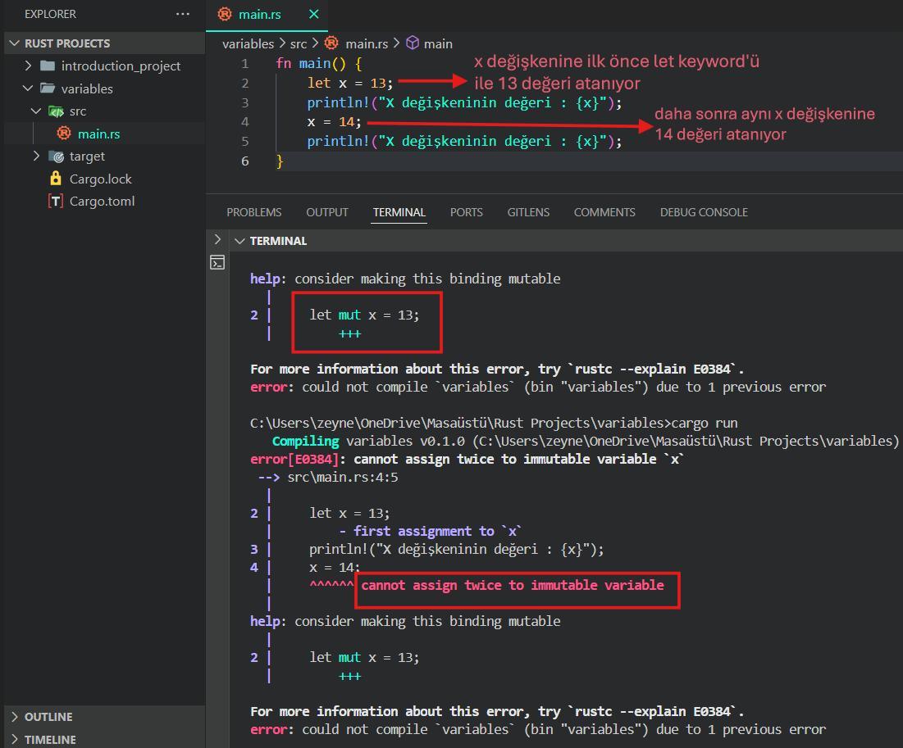
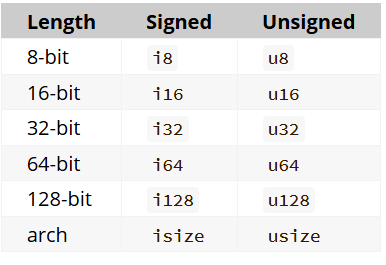
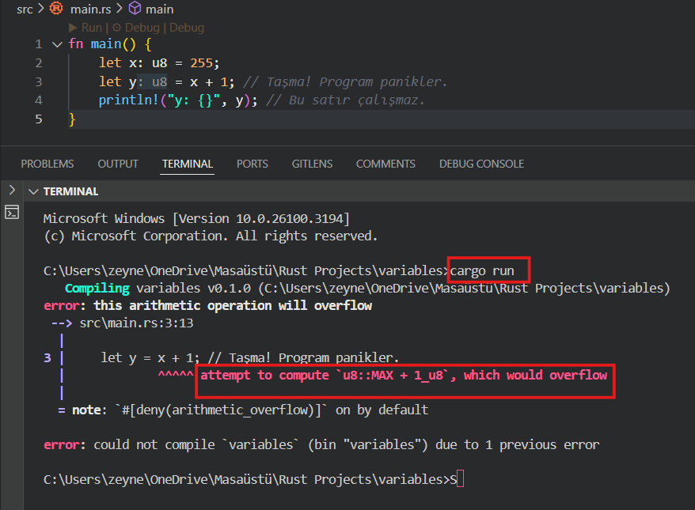
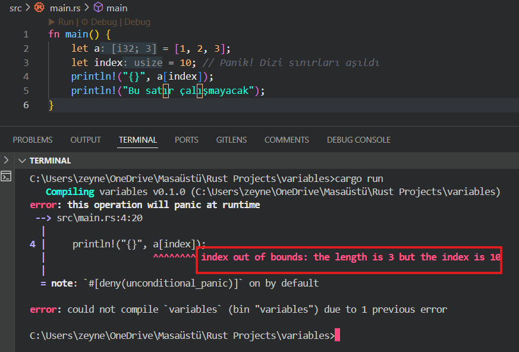

# Rust Gün 2 :

- Önceki derste Rust kurulumunu, cargo komutlarının işlevlerini ve cargo komutlarıyla bir Rust projesi oluşturmayı öğrendik. Daha sonra ilk projemizi oluşturduk ve programlamaya girişin ilk cümlesi olan “*Hello, World!“* çıktısını aldık.
- Bugün ise Rust’ta değişken tanımlama, veri türleri, taşma kontrolü fonksiyonları, shadowing ve immutability kavramlarını inceleyeceğiz.

---

# Variables and Mutability (Değişkenler ve Değişebilirlik):

## 1. Immutable (Değiştirilemez) Değişken:

- Rust'ta değişkenler `let` anahtar kelimesiyle tanımlanır.
- Rust’ta değişkenler default olarak değiştirilemez (immutable) olarak tanımlanır.
- Eğer değişkeni değiştirilebilir yapmak istiyorsanız yani değişkenin değerini sonradan değiştirmek istiyorsanız, `mut` anahtar kelimesini kullanmanız gerekir.

### Immutable değişkene yeni değer atarsak ne olur?

- Immutable değişkene yeniden değer atama işlemi yaparsanız yani değerini değiştirmeye çalışırsanız kodu cargo run komutu ile çalıştırdıktan sonra terminalden aşağıdaki gibi “cannot assign twice to immutable variable” hata mesajını alırsınız.



- Bu durum, programınızın davranışını daha öngörülebilir hale getirir ve olası hataları azaltır.

```rust
fn main() {
    let x = 5; // x, 5 değerine sahip değiştirilemez bir değişkendir.
    // x = 6; // Bu hata verir! (cannot assign twice to immutable variable `x`)
    println!("x'in değeri: {}", x);
}
```

## 2. Mutable (Değiştirilebilir) Değişkenler :

- Eğer bir değişkenin değerini değiştirmek istiyorsak, `mut` anahtar kelimesini kullanmalıyız:

```rust
let mut y = 10;
println!("y'nin ilk değeri: {}", y); // y'nin ilk değeri: 10
y = 20; // Geçerli, çünkü y mutable'dır.
println!("y'nin yeni değeri: {}", y); // y'nin yeni değeri: 20
```

- Ayrıca `mut`anahtar kelimesinin kullanılması, kodu okuyan kişilere bu değişkenin değerinin gelecekte değişebileceğini göstererek kodun daha kolay anlaşılmasını sağlar.

### 3. Const (Sabit) Değişkenler :

- Sabit değişkenler, program boyunca değişmeyen değerlerdir.
- Sabit değişkenler `const` ile tanımlanır ve **mut olamazlar.**
- const değerler derleme zamanında (compile-time) hesaplanmalıdır. Compiler, değeri hesaplayabilmesi için değişkenin türünü bilmelidir. Tür bilgisi olmadan, compiler bu hesaplamayı yapamaz.  Bu yüzden sabit değerin türü açıklanmalıdır.

- Türü açıklanmayan sabit değer aşağıdaki gibi bir derleme hatası verir.
    
    ```rust
    const MAX_POINTS: u32 = 100_000; // Sabit bir değişken tanımlama (veri tipi belirtilmeli)
    
    const MAX_VALUE = 100; // error[E0438]: constant `MAX_VALUE` needs a type
    // Yanlış: Tür belirtilmemiş (derleme hatası verir)
    ```
    
- Sabitler, global scope da dahil olmak üzere herhangi bir kapsamda tanımlanabilir. Bu özellikleri, sabitleri kodun birçok bölümünün erişebileceği ve bilmesi gereken değerler için elverişli kılar. (kapsam tanımlamalarına ileride değineceğim)
- Özetle; sabitler (const), derleme zamanında bilinen, değişmeyen değerler için kullanılır. Değişkenler (let) ise, değerleri çalışma zamanında hesaplanabilen ve değişebilen değerler için kullanılır. Sabitler, sabit ifadelerle tanımlanırken, değişkenler çalışma zamanında hesaplanan değerlere atanabilir.

```rust
**const THREE_HOURS_IN_SECONDS: u32 = 60 * 60 * 3;
// Derleyici, derleme zamanında sınırlı bir işlem kümesini değerlendirebilir; bu da bu değeri 10.800 değerine ayarlamak yerine, anlaşılması ve doğrulanması daha kolay bir şekilde yazmayı seçmemize olanak tanır.**
```

***💡 Not :**  Rust'ın sabitler için adlandırma kuralı, kelimeler arasında alt çizgilerle tüm büyük harfleri kullanmaktır.*

---

**Değişken Anahtar Kelimeleri için Özet Tablo:**

| **Anahtar Kelime** | **Değiştirilebilirlik** | **Tür Belirtme** | **Compile Time’da Değeri** |
| --- | --- | --- | --- |
| let | Immutable (Değiştirilemez) | Genellikle Gerekli Değil (Tür çıkarımı) | Gerekli Değil |
| mut | Mutable (Değiştirilebilir) | Genellikle Gerekli Değil (Tür çıkarımı) | Gerekli Değil |
| const | Immutable (Değiştirilemez) | Gerekli | Gerekli |

---

# Shadowing :

- Yukarıda immutable tanımlanan değişkenlerin değerlerinin değiştirlemez olduğunu belirtmiştik ancak shadowing yöntemiyle aynı adı taşıyan yeni bir değişken bildirebilirsiniz.
- Shadowing (gölgelme) tekniğinde, aynı isimde ikinci bir değişken tanımlandığında, ilk değişken 'gölgelenmiş' olur. Bu durumda, kod içinde o değişken adına yapılan tüm referanslar, shadowing gerçekleşen yerden itibaren, ikinci değişkene aittir. Bu durum, ikinci değişkenin tanımlandığı kapsam sona erene veya kendisi de başka bir değişken tarafından gölgelenene kadar devam eder.
- Yani aslında değişkenin *değerini* doğrudan değiştirmiyorsunuz. Onun yerine, **aynı isme sahip yeni bir değişken** oluşturuyorsunuz. Bu yeni değişken, eski değişkeni "gölgede bırakıyor" (shadowing).

```rust
fn main() {
	let x = 5;
	let x = x + 1;
	{
	    let x = x * 2;
	    println!("İç kapsamdaki x değeri : {x}");  // x'in iç kapsamdaki değeri: 12
	}
	println!("x'in değeri : {x}");  //x'in değeri: 6
}
```

- Yukarıdaki kodda, x’e önce 5 değeri verilir. Sonra x’e shadowing ile 1 ekler ve böylece x'in değeri 6 olur. Daha sonra iç kapsamda önceki değeri 2 ile çarparak x'e 12 değerini verir. Bu kapsam sona erdiğinde, içteki shadowing sona erer ve x’in değeri 6 olur.

- Shadowing, yanlışlıkla değişkenin değerini değiştirme riskini ortadan kaldırır çünkü `let` kullanmadan değişkeni yeniden atayamazsınız.
- Shadowing, bir değer üzerinde birden fazla dönüşüm yaparken, sonunda değişkenin immutable (değiştirilemez) kalmasını sağlar.
- Aynı isimle yeni bir değişken oluşturarak, tür değişikliği yapabilirsiniz. Örneğin, bir string'i sayıya dönüştürüp aynı ismi kullanabilirsiniz. Örneğin;

```rust
use std::any::type_name; // type_name fonksiyonunu kullanabilmek için gerekli

fn print_type_of<T>(_: T) { // T türünü yazdırmak için bir fonksiyon
    println!("{}", type_name::<T>()); 
}

fn main() {
    let x = "42"; // x'in türü string

    // Aşağıda x'i shadowing tekniğiyle gölgeliyoruz ve i32'ye dönüştürüyoruz:
    let x = x.parse::<i32>().expect("Dönüştürme başarısız oldu");

    println!("x'in değeri: {}", x); // 42 yazdırır
    print_type_of(x);  // i32 yazdırır
}
```

---

# Veri Türleri :

- Rust, **statik tür sistemine** sahip bir programlama dilidir.
- Bu, tüm değişkenlerin ve ifadelerin türlerinin **derleme zamanında (compile-time)** bilindiği ve kontrol edildiği anlamına gelir.
- Statik tür sistemi, Rust'ın güvenli ve performanslı olmasını sağlayan temel özelliklerden biridir.
- Statik tür sisteminin hataları erken tespit etme gibi bir avantajı da vardır. Tür hataları derleme zamanında tespit edilir, bu da çalışma zamanında (runtime) ortaya çıkabilecek hataları önler.
- Türlerin açıkça belirtilmesi veya çıkarılması, kodun daha okunabilir olmasını sağlar. Bu ekip çalışmalarında büyük avantaj sağlar.
- Derleyici, tür bilgilerini kullanarak daha etkili optimizasyonlar yapabilir. Bu, programın daha hızlı çalışmasını sağlar.

***💡** Not : Statisk tür sistemi, bellek güvenliği ve veri bütünlüğü sağlar. Rust programlama dilinde C ve C++ gibi dillerde olduğu gibi null pointer hataları mümkün değildir. Null pointer hataları, bir programın geçersiz veya boş (`null`) bir bellek adresine erişmeye çalışması durumunda ortaya çıkar. Bu tür hatalar, çalışma zamanında (runtime) ortaya çıkar ve genellikle programın çökmesine neden olur.* 

### **Rust'ta Tür Belirtme ve Tür Çıkarımı :**

- Rust'ta türler açıkça belirtilebilir veya derleyici tarafından otomatik olarak çıkarılabilir.

**Açık Tür Belirtme**:

```rust
let x: i32 = 5; // x'in türü açıkça i32 olarak belirtilmiş.
let y: f64 = 3.14; // y'nin türü açıkça f64 olarak belirtilmiş.
```

**Tür Çıkarımı (Type Interface):**

```rust
let x = 5; // x'in türü otomatik olarak i32 çıkarılır.
let y = 3.14; // y'nin türü otomatik olarak f64 çıkarılır.
```

---

Rust’ta  veri türlerini iki gruba ayırabiliriz : Skaler (Scaler) türler ve Bileşik (Compound)  türler

## Skaler Türler :

- Skaler türler, tek bir değeri temsil eden temel veri türleridir.
- Rust'ta dört ana skaler tür vardır:  Integer, float, boolean, char
    
    ### Integer (Tam Sayılar):
    
    - Rust'ta tam sayılar, kesirli kısmı olmayan sayılardır ve işaretli (i) veya işaretsiz (u) olabilirler.
    - İşaretli tam sayılar negatif değerler alabilirken, işaretsizler sadece pozitif değerler alabilir.
    - İşaretli (`i`): Negatif ve pozitif tam sayıları temsil eder. Örnek: `i8`, `i16`, `i32`, `i64`, `i128`, `isize`.
    - İşaretsiz (`u`): Sadece pozitif tam sayıları temsil eder. Örnek: `u8`, `u16`, `u32`, `u64`, `u128`, `usize`.
    - Default (varsayılan) tür: `i32`.
    
    **i8  (8-bit işaretli tam sayı) :** 
    
    - Bellekte 8 bit (1 byte) yer kaplar.
    - Değer aralığı:  -128 ile 127 arasında.  ( `-2^7` ile`2^7 - 1`)
    
    ```rust
    let x: i8 = -42;
    println!("x: {}", x); // x: -42
    ```
    
    **u8 (8-bit işaretsiz tam sayı) :** 
    
    - Bellekte 8 bit (1 byte) yer kaplar.
    - Değer aralığı: `0` ile `255` arasında. (`0` ile `2^8 - 1`)
    
    ```rust
    let a: u8 = 255;
    println!("a: {}", a); // a: 255
    ```
    
    ***💡** Not :*   *Evet, Rust'ta **işaretsiz (`u`) türlerin değer aralığı**, aynı bit genişliğine sahip **işaretli (`i`) türlerin değer aralığının yaklaşık iki katıdır**. Bunun nedeni, işaretsiz türlerin sadece pozitif değerleri temsil etmesi, işaretli türlerin ise hem negatif hem de pozitif değerleri temsil etmesidir.*
    
    **i16 (16-bit işaretli tam sayı) :** 
    
    - Bellekte 16 bit (2 byte) yer kaplar.
    - Değer aralığı:  **-2^15** ile **2^15 -1** arasında.
    
    ```rust
    let y: i16 = 30000;
    println!("y: {}", y); // y: 30000
    ```
    
    **u16 (16-bit işaretsiz tam sayı) :** 
    
    - Bellekte 16 bit (2 byte) yer kaplar.
    - Değer aralığı: 0 ile **2^16 - 1** arasında.
    
    ```rust
    let b: u16 = 65535;
    println!("b: {}", b); // b: 65535
    ```
    
    **i32 (32-bit işaretli tam sayı) :** 
    
    - Bellekte 32 bit (4 byte) yer kaplar.
    - Değer aralığı: `-2^31` ile `2^31 - 1` arasında.
    - Varsayılan (default) tam sayı türüdür.
    
    ```rust
    let z: i32 = -1_000_000;
    println!("z: {}", z); // z: -1000000
    ```
    
    ***💡** Not :  Rust'ta **`_` (alt çizgi)**, sayısal değerlerin okunabilirliğini artırmak için kullanılır. Özellikle büyük sayılar yazarken, sayının basamaklarını gruplamak ve daha kolay anlaşılmasını sağlamak için kullanılır. Bu, sayının değerini ve türünü etkilemez.*
    
    **i64 (64-bit işaretli tam sayı) :** 
    
    - Bellekte 64 bit (8 byte) yer kaplar.
    - Değer aralığı:  `-2^63` ile `2^63 - 1`arasında.
    
    ```rust
    let w: i64 = 9_223_372_036_854_775_807;
    println!("w: {}", w); // w: 9223372036854775807
    ```
    
    **u64 (64-bit işaretsiz tam sayı) :** 
    
    - Bellekte 64 bit (8 byte) yer kaplar.
    - Değer aralığı: `0` ile `2^64 - 1` arasında.
    
    ```rust
    let d: u64 = 18_446_744_073_709_551_615;
    println!("d: {}", d); // d: 18446744073709551615
    ```
    
    **i128 (128-bit işaretli tam sayı) :**
    
    - Bellekte 128 bit (16 byte) yer kaplar.
    - Değer aralığı : `0` ile `2^64 - 1` arasında
    
    ```rust
    let large: i128 = 170_141_183_460_469_231_731_687_303_715_884_105_727;
    println!("large: {}", large); // large: 170141183460469231731687303715884105727
    ```
    
    **u128 (128-bit işaretsiz tam sayı) :** 
    
    - Bellekte 128 bit (16 byte) yer kaplar.
    - Değer aralığı: `0` ile `2^128 - 1` arasında.
    
    ```rust
    let e: u128 = 340_282_366_920_938_463_463_374_607_431_768_211_455;
    println!("e: {}", e); // e: 340282366920938463463374607431768211455
    ```
    
    - Her tam sayı türü, bellekte belirli bir bit sayısını kaplar (örn., i32, u8). isize ve usize türleri, sistem mimarisine (32-bit veya 64-bit) bağlı olarak değişir.
    - Tam sayı sabitleri, okunabilirliği artırmak için _ ayırıcılarını kullanabilir.
    - İşaretli tam sayıların alabileceği değer aralığı -(2^(n-1)) ile 2^(n-1) - 1 arasındadır, işaretsiz tam sayıların aralığı ise 0 ile 2^n - 1 arasındadır (burada n bit sayısını temsil eder).
    - Aşağıdaki tablo Rust’un kendi websitesinden aldığım integer türler ve bellekte kapladıkları alanları veren bilgiler içerir.
    
    
    
    ***💡** Not : Rust'ta arch doğrudan bir veri tipi değil, donanıma özgü işlemleri (özellikle SIMD) kullanarak performans optimizasyonu sağlayan bir modüldür ve düşük seviyeli sistem programlama veya yüksek performanslı hesaplamalar için kullanılır.*
    
    **isize (Sistem mimarisine bağlı işaretli tam sayı) :**
    
    - Bellekteki boyutu sistem mimarisine bağlıdır (32-bit sistemde 32 bit, 64-bit sistemde 64 bit).
    - Değer aralığı: `i32` veya `i64` ile aynıdır.
    - 32-bit sistemde: `2^31` ile `2^31 - 1`
    - 64-bit sistemde: `2^63` ile `2^63 - 1`
    
    ```rust
    let size: isize = -10;
    println!("size: {}", size); // size: -10
    ```
    
    **usize (Sistem mimarisine bağlı işaretsiz tam sayı) :** 
    
    - Bellekteki boyutu sistem mimarisine bağlıdır (32-bit sistemde 32 bit, 64-bit sistemde 64 bit).
    - Değer aralığı: `u32` veya `u64` ile aynıdır.
    - 32-bit sistemde: `0` ile `2^32 - 1`
    - 64-bit sistemde: `0` ile `2^64 - 1`
    
    ```rust
    let size: usize = 10;
    println!("size: {}", size); // size: 10
    ```
    
    ---
    
    ### Integer Oweflow :
    
    Rust'ta **tamsayı taşması (integer overflow)**, bir tamsayı değişkeninin alabileceği maksimum veya minimum değeri aşması durumunda ortaya çıkar. Bu durum, özellikle işaretsiz tamsayı türleri ve işaretli tamsayı türleri için geçerlidir. 
    
    Örneğin:
    
    - **`u8`** türü, `0` ile `255` arasında değerler alabilir. Eğer `255` değerine sahip bir `u8` değişkenine `1` eklerseniz, taşma meydana gelir.
    - **`i8`** türü, `128` ile `127` arasında değerler alabilir. Eğer `127` değerine sahip bir `i8` değişkenine `1` eklerseniz, taşma meydana gelir.
    
    **Rust'ta Tamsayı Taşma Durumları :** 
    
    1. **Hata Ayıklama Modu (Debug Mode)**
    - Rust, hata ayıklama modunda tamsayı taşması denetimleri yapar.
    - Taşma meydana gelirse, program **panikler (panic)** ve çalışmayı durdurur.
    - Bu, geliştirme sırasında hataları tespit etmek için kullanışlıdır.
    
    Örnek;
    
    ```rust
    fn main() {
        let x: u8 = 255;
        let y = x + 1; // Taşma! Program panikler.
        println!("y: {}", y); // Bu satır çalışmaz.
    }
    ```
    
    Hata mesajı:  `*thread 'main' panicked at 'attempt to add with overflow',*`
    
    - Bu sayede, hatalı işlemler tespit edilerek program güvenli hale getirilir.
    - Aşağıdaki örnekte terminalde debug mode için `cargo run` komutunu çalıştırdım ve aşağıdaki hatayı aldım.
        
        
        
    
    1. **Release Modu :**
    - Rust, önceki sürümlerinde release modunda tamsayı taşması denetimlerini **devre dışı bırakırdı ama** Rust **1.68 ve sonrasında**, **tamsayı taşmaları artık derleme zamanında hata olarak algılanmaya başlandı.**
    - Aşağıdaki örnekte terminalde release mode için `cargo run --release` komutunu çalıştırdım ve debug mode’da aldığım hatanın aynısını aldım.
    - Önceki sürümlerde release mode’da wrap around (döngüsel taşma) uygulanarak maksimum değerden sonra minimum değere "sarılır" ve aşağıdaki kod için “0” çıktısı alınırdı.
        
        
        
    
    - **wrapping_*:  Taşma durumunda değeri sarmalar.**
        
        **Genel syntax :**
        
        ```rust
        let sonuc = deger.wrapping_add(eklenecek_deger);
        let sonuc = deger.wrapping_sub(cikarilacak_deger);
        let sonuc = deger.wrapping_mul(carpilacak_deger);
        let sonuc = deger.wrapping_div(bolunecek_deger);
        let sonuc = deger.wrapping_rem(mod_alinacak_deger);
        ```
        
        *Örnekler:*
        
        ```rust
        fn main() { 
            let x: u8 = 255; 
            let y = x.wrapping_add(1); // 255 + 1 → 0 olur
            println!("wrapping_add sonucu: {}", y); // wrapping_add sonucu: 0
        }
        ```
        
        - *Yukarıdaki fonksiyonda; u8 veri tipi 0-255 arasında değer alabilir. 255 değerine 1 eklediğimizde 256 olur ve bu değer u8 veri tipinin sınırlarını aşar. Bu durumda Rust, bu durumu ele almak için 0 değerini döndürür.*
        
        ```rust
        fn main() { 
            let x: u8 = 254; 
            let y = x.wrapping_add(1); // 254 + 1 = 255
            println!("wrapping_add sonucu: {}", y); // wrapping_add sonucu: 255
        }
        ```
        
        - *Yukarıdaki fonksiyonda; wrapping_add sonucu: 255 olur ve wrapping_add fonksiyonu sarmalama yapmaz çünkü işlem sonucu 255 ve 255 değeri u8 veri türünün sınırlarını aşmaz.*
    - **checked_*: Taşma olursa `None` döndürür, aksi halde `Some(değer)` döndürür.**
        
        **Genel Syntax :** 
        
        ```rust
        let sonuc = deger.checked_add(eklenecek_deger);
        let sonuc = deger.checked_sub(cikarilacak_deger);
        let sonuc = deger.checked_mul(carpilacak_deger);
        let sonuc = deger.checked_div(bolunecek_deger);
        let sonuc = deger.checked_rem(mod_alinacak_deger);
        ```
        
        ***💡 Not :** `Option<T>` döndürdüğü için `match` veya `if let` ile kontrol edilmesi gerekir.*
        
        *Örnekler :*
        
        ```rust
        fn main() {
            let x: u8 = 255;
           
            match x.checked_add(1) { // checked_add fonksiyonu taşma oluştuğunda None değeri döner.
                Some(result) => println!("Sonuç: {}", result), 
                None => println!("Taşma oluştu!"), // Çıktı: Taşma oluştu!
            }
        }
        ```
        
        - *Yukarıdaki fonksiyonda; 255 sayısına 1 eklediğimizde taşma oluştuğu için `None` değeri dönecektir.*
        
        ```rust
        fn main() {
            let x: u8 = 254;
           
            match x.checked_add(1) { // checked_add fonksiyonu taşma oluştuğunda None değeri döner.
                Some(result) => println!("Sonuç: {}", result),  // Sonuç: 255 çıktısını verir.
                None => println!("Taşma oluştu!"),  
            }
        }
        ```
        
        - *Yukarıdaki fonksiyonda; x değeri 254 olduğu için 1 eklediğimizde 255 olur. u8 veri tipinin maksimum değeri 255'tir ve u8 tipinin değer aralığını aşmadığından dolayı taşma oluşmaz. Bu yüzden Some(result) değeri döner ve Sonuç: 255 çıktısını verir.*
    
    - overflowing_*:  İşlemin sonucunu ve taşma olup olmadığını belirten bir boolean değer döndürür.
        
        **Genel Syntax :**
        
        ```rust
        let (sonuc, tasma) = deger.overflowing_add(eklenecek_deger);
        let (sonuc, tasma) = deger.overflowing_sub(cikarilacak_deger);
        let (sonuc, tasma) = deger.overflowing_mul(carpilacak_deger);
        let (sonuc, tasma) = deger.overflowing_div(bolunecek_deger);
        let (sonuc, tasma) = deger.overflowing_rem(mod_alinacak_deger);
        ```
        
        ***💡 Not :***  Burada tasma değişkeni true ise taşma meydana gelmiştir.
        
        *Örnekler :* 
        
        ```rust
        fn main() {
            let a: u8 = 255;
        
            let (result, overflowed) = a.overflowing_add(1); // a + b işlemi
            println!("Sonuç: {}, Taşma: {}", result, overflowed); // Çıktı: Sonuç: 0, Taşma: true
        }
        ```
        
        - *Yukarıdaki fonksiyonda; Sonuç: 0 ve Taşma: true çıktısını alıyoruz. Çünkü u8 veri tipinin maksimum değeri 255'tir ve 1 eklediğimizde taşma oluşur.*
        
        ```rust
        fn main() {
            let a: u8 = 254;
        
            let (result, overflowed) = a.overflowing_add(1); // a + b işlemi
            println!("Sonuç: {}, Taşma: {}", result, overflowed); // 
        }
        ```
        
        - *Yukarıdaki fonksiyonda; Sonuç: 255, Taşma: false çıktısını alırız çünkü 254 + 1 = 255 ve u8 veri tipinin maksimum değeri 255'tir. Bu yüzden taşma olmaz.*
        
    - saturating_*: Değeri, taşma durumunda değeri türün maksimum veya minimum değerine sabitler (saturate).
        
        **Genel Syntax :** 
        
        ```rust
        let sonuc = deger.saturating_add(eklenecek_deger);
        let sonuc = deger.saturating_sub(cikarilacak_deger);
        let sonuc = deger.saturating_mul(carpilacak_deger);
        ```
        
        ***💡 Not :** saturating_div ve saturating_rem metodları Rust'ta bulunmaz çünkü bölme işlemi doğal olarak sınırları aşmaz.*
        
        *Örnekler :*
        
        Eğer işlemin sonucu, türün **maksimum değerinden büyük** olacaksa, sonuç **maksimum değere** sabitlenir.
        
        ```rust
        fn main() {
            let a: u8 = 255; // u8 için maksimum değer: 255
        
            let result = a.saturating_add(1); // 255 + 1 = 256 (u8 için taşma)
            println!("{}", result); // Çıktı: 255 (maksimum değere sabitlendi)
        }
        ```
        
        - *Yukarıdaki fonksiyonda; saturating_add fonksiyonu, taşma durumunda maksimum değeri döndürür çünkü u8 veri tipi için maksimum değer 255'tir ve işlemin sonucu maksimum değeri aşmıştır.*
        
        Eğer işlemin sonucu, türün **minimum değerinden küçük** olacaksa, sonuç **minimum değere** sabitlenir.
        
        ```rust
        fn main() {
            let a: i8 = -128; // i8 için minimum değer: -128
            let b: i8 = 1;
        
            let result = a.saturating_sub(b); // -128 - 1 = -129 (i8 için taşma)
            println!("{}", result); // Çıktı: -128 (minimum değere sabitlendi)
        }
        ```
        
        - *Yukarıdaki fonksiyonda; saturating_sub fonksiyonu, taşma durumunda minimum değeri döndürür. Çünkü i8 veri tipi için minimum değer -128'dir. Bu nedenle yukarıdaki işlemin sonucu olan -129 değeri -128'e sabitlenir ve sonuç -128 olur.*
        
        Eğer işlemin sonucu, türün değer aralığını aşmıyorsa işlem sonucunu çıktı verir.
        
        ```rust
        fn main() {
            let a: i8 = -128; // i8 için minimum değer: -128
            let b: i8 = -1;
        
            let result = a.saturating_sub(b); // -128 - (-1) = -127 (taşma yok)
            println!("{}", result); // Çıktı: -127
        }
        ```
        
        - *Yukarıdaki fonksiyonda, i8 veri türü için minimum değer -128 olduğu için taşma olmaz bu sebeple minimum veya maksimum değerlere sabitleme yapmaz. Direkt olarak işlemi yapar ve sonucu döndürür. Çıktı -127 olacaktır.*
    
    ---
    
    ### Float (Ondalıklı Sayılar):
    
    - Rust’ta `f32` ve `f64` olmak üzere iki float türü vardır.
    - Default olarak `f64` kullanılır  çünkü modern CPU'larda f32 ile hemen hemen aynı hızdadır ancak daha fazla hassasiyete sahiptir
    - Tüm ondalıklı sayı türleri işaretlenmiştir.
    - Bu türler, IEEE 754 standardına uygun olarak tanımlanmıştır ve belirli bir bit genişliğine sahiptir.
    
    **f32 (32-bit ondalıklı sayı) :** 
    
    - Bellekte 32 bit (4 byte) yer kaplar.
    - Daha az bellek kullanır, ancak daha düşük hassasiyete sahiptir.
    - Tek hassasiyetli (single-precision) kayan noktalı sayı.
    
    ```rust
    let x: f32 = 3.14; // 32-bit kayan noktalı sayı
    let y: f32 = -0.001; // Negatif 32-bit kayan noktalı sayı
    println!("x: {}, y: {}", x, y); // x: 3.14, y: -0.001
    ```
    
    **f64 (64-bit ondalıklı sayı) :** 
    
    - Bellekte 32 bit (4 byte) yer kaplar.
    - Daha fazla bellek kullanır, ancak daha yüksek hassasiyete sahiptir.
    - Çift hassasiyetli (double-precision) kayan noktalı sayı.
    
    ```rust
    let a: f64 = 2.718; // 64-bit kayan noktalı sayı
    let b: f64 = -1.602; // Negatif 64-bit kayan noktalı sayı
    let x = 2.0; // x'in türü f64
    println!("a: {}, b: {}", a, b); // a: 2.718281828459045, b: -1.602176634e-19
    ```
    
    ---
    
    ***💡** Not: **IEEE 754 Standardı**, bilgisayarlarda **kayan noktalı sayıların** (floating-point numbers) nasıl temsil edileceğini ve işleneceğini tanımlayan uluslararası bir standarttır. Bu standart, kayan noktalı sayıların bellek üzerinde nasıl saklanacağını, matematiksel işlemlerin nasıl yapılacağını ve özel durumların (örneğin, sonsuzluk veya NaN) nasıl ele alınacağını belirler.*
    
    ***Çift hassasiyetli (double-precision) kayan noktalı sayılar**, IEEE 754 standardında tanımlanan iki ana kayan noktalı sayı formatından biridir. Diğeri ise **tek hassasiyetli (single-precision)** kayan noktalı sayılardır. Çift hassasiyetli sayılar, daha geniş bir değer aralığı ve daha yüksek hassasiyet sunar.*
    
    ---
    
    ### Boolean (Mantıksal Tür) :
    
    - Rust'ta **`bool`** türü, **boolean** değerlerini temsil eder.
    - `bool` veri türü sadece `true` veya `false` değerlerini alır.
    - `bool` türü, bellekte **1 byte** (8 bit) yer kaplar. Ancak, yalnızca 1 bit bilgi taşır (`true` veya `false`).
    - Varsayılan (default) değeri `false`'dur
    
    ```rust
    let is_active: bool = true;
    let is_disabled = false; // Default olarak bool türüne sahiptir
    ```
    
    ---
    
    ### Char (Karakter Tipi - 32 bit) :
    
    - Rust'ın char türü dilin en ilkel alfabetik türüdür.
    - Tek tırnak (`' '`) içinde tanımlanır. Rust’ta `char` 4 byte (Unicode) uzunluğundadır.
    - Unicode Skaler Değerini temsil eder; bu da yalnızca ASCII'den çok daha fazlasını temsil edebileceği anlamına gelir. Aksanlı harfler; Çince, Japonca ve Korece karakterler; emoji; ve sıfır genişlikte boşluklar, Rust'ta geçerli karakter değerleridir.
    
    ```rust
    let harf: char = 'A';
    let emoji: char = '🦀';
    let c = 'z';
    ```
    
    ***💡** Not : Unicode, dünya üzerindeki tüm yazı sistemlerini ve sembolleri temsil etmek için tasarlanmış bir standarttır. Rust'ın `char` türü, bir **Unicode Skaler Değerini** (Unicode Scalar Value) temsil eder.*
    

---

## **Bileşik Türler (Compound Types):**

- Rust'ta bileşik türler (compound types), birden fazla değeri tek bir türde gruplandırmak için kullanılır.
- Rust'ın iki temel ilkel bileşik türü vardır: tuple'lar ve diziler (array).
- Bu türler, farklı veri yapılarını temsil etmek ve organize etmek için kullanılır.

### Tuple’lar (Demetler) :

- Tuple'lar, farklı türlerdeki değerleri tek bir grup halinde birleştirmek için kullanılır.
- Tuple'lar sabit uzunluktadır, yani bir kez tanımlandıktan sonra boyutu değiştirilemez.
- Tuple'lar, parantez `()` içinde virgülle ayrılmış değerlerle tanımlanır.
- Her bir değerin türü açıkça belirtilebilir veya Rust'ın tür çıkarımı (type inference) özelliği kullanılabilir.

```rust
let my_tuple = (10, "Merhaba", 3.14, true);
```

**Yapıbozma (Destructuring):**

- Yukarıdaki örnekte my_tuple değişkeni tuple'ın tamamına bağlanır çünkü bir tuple tek bir bileşik öğe olarak kabul edilir.
- Tuple’daki elemanlara erişmek  için, Yapıbozma (Destructuring) işlemi yapılır.
- Aşağıda, tuple'daki her bir değeri ayrı bir değişkene atadım ve çıktılarını aldım.

```rust
let (sayi, metin, kesirli, dogru_mu) = my_tuple;
println!("Sayı: {}", sayi);
println!("Metin: {}", metin);
println!("Kesirli: {}", kesirli);
println!("Doğru mu: {}", dogru_mu);
```

***💡** Not :*   *`{}` içinde belirtilen değerler, **Display** trait'i kullanılarak yazdırılır. Bu, değerlerin insanlar tarafından okunabilir bir şekilde formatlanmasını sağlar.*

**İndeksleme :**

- Bu yöntemle, erişmek istediğimiz değerin dizinini takip eden bir nokta (.) kullanarak bir tuple öğesine doğrudan erişebiliriz.
- Her elemana, tuple_adı.indeks_numarası şeklinde erişebiliriz (indeks 0'dan başlar).

```rust
let ilk_eleman = my_tuple.0; // 10
let ikinci_eleman = my_tuple.1; // "Merhaba"
```

- Yukarıdaki örnekte my_tuple değişkenini indeksleyerek tuple içindeki elemanlara erişmiş oldum.

**Unit Tuple (Boş Tuple):**

- **Unit tuple** Rust'ta değer döndürmeyen fonksiyonların dönüş türüdür.
- `()` şeklinde gösterilir.
- Bellekte sıfır boyuta sahiptir ve herhangi bir değer içermez.
- Bloklar, ifadeler ve fonksiyonlar, açıkça bir değer döndürmediklerinde otomatik olarak `()` döndürür.
- Değer döndürmeyen fonksiyonlar (void gibi) aslında `()` yani unit tuple döndürürler.

Aşağıdaki örnekte olduğu gibi, bir fonksiyonun dönüş türünü açıkça `()` olarak belirtebilirsiniz.

```rust
fn do_nothing() -> () { // `()` dönüş tipi
    println!("Hiçbir şey yapmıyorum!");    
}

fn main() { 
    let result = do_nothing(); // Fonksiyon çağrısı
    println!("Fonksiyonun dönüş değeri: {:?}", result); // `()` çıktılanır
} 
```

***💡** Not :*  `*:?` ifadesi, **debug formatlama** için kullanılır. Bu, değişkenin içeriğini insanların okuyabileceği bir şekilde (debug representation) yazdırır. `()` (unit type), debug formatında `()` olarak yazdırılır.*

- Rust'ta bir fonksiyon, açıkça bir değer döndürmezse, otomatik olarak `()` (unit tuple) döndürür. Örnek;

```rust
fn yazdir() {
    println!("Bu fonksiyon bir şey döndürmüyor.");
}

fn main() {
    let sonuc = yazdir(); // `yazdir` fonksiyonunu çağırıyoruz.
    println!("Fonksiyonun dönüş değeri: {:?}", sonuc); // "Fonksiyonun dönüş değeri: ()" yazdırır
}

```

Rust'ta bir blok (scope), son ifadenin değerini döndürür. Eğer aşağıdaki örnekte olduğu gibi blok içinde bir değer döndürülmezse yani `return` ifadesi kullanılmazsa, blok `()` döndürür.

```rust
fn main() {
    let result = {
        let x = 5;
        let y = 10;
        x + y; // Bu ifade bir değer döndürmez, bu nedenle blok `()` döndürür.
    };
    println!("Blok'un dönüş değeri: {:?}", result); // Blok'un dönüş değeri: ()
}
```

- Unit tuple, desen eşleme (pattern matching) sırasında da kullanılabilir.
- Aşağıdaki örnekte **unit type** (`()`), `check_value` fonksiyonunun dönüş türü olarak kullanılmıştır.  Bu, fonksiyonun herhangi bir değer döndürmediğini gösterir.
- Fonksiyon, `match` ifadesi kullanarak `value` parametresini kontrol eder ve uygun mesajı yazdırır. Ancak, fonksiyonun sonunda açıkça bir değer döndürülmez. Bu durumda, Rust otomatik olarak `()` döndürür.

```rust
fn check_value(value: i32) -> () {
    match value {
        0 => println!("Değer sıfır."),
        _ => println!("Değer sıfır değil."),
    }
}

fn main() {
    check_value(0); // Değer sıfır.
    check_value(42); // Değer sıfır değil.
}
```

---

### Array (Dizi) :

- Diziler, aynı türden birden fazla değeri sıralı bir şekilde saklayan, sabit boyutlu veri yapılarıdır.
- Tuple'lardan farklı olarak, bir dizideki tüm elemanlar aynı türde olmalıdır.
- "Sabit boyutlu" olduğu için, diziyi oluşturduktan sonra eleman sayısını değiştiremeyiz.
- Diziler, köşeli parantez `[]` içinde virgülle ayrılmış değerlerle tanımlanır. Dizinin türü ve boyutu açıkça belirtilebilir.
- Diziler, bellekte ardışık (contiguous) bir şekilde saklanır. Bu, dizilere erişimin hızlı olmasını sağlar.

```
fn main() {
    let array: [i32; 5] = [1, 2, 3, 4, 5]; // Tür ve boyut açıkça belirtildi
    println!("Array: {:?}", array); // Array: [1, 2, 3, 4, 5]
}
```

***💡** Not :*  `*:?` ifadesinin, **debug formatlama** için kullanıldığına değinmiştim aynı şekilde dziler de display* trait'ini otomatik olarak uygulamaz. Bu nedenle, `{}` kullanarak bir diziyi doğrudan yazdırmak mümkün değildir. Aşağıdaki gibi hata verir:

```rust
println!("Array: {}", array); // Hata! [i32; 5] türü Display trait'ini uygulamıyor.
```

**Ne Zaman Dizi Kullanmalıyız?**

- Eleman sayısının derleme zamanında bilindiği durumlar (örn., haftanın günleri, bir matrisin boyutu).
- Verilerin stack’te saklanması gerektiği durumlar (vektörler heap'te saklanır).
- Performans kritik uygulamalarda (dizilere erişim vektörlere göre biraz daha hızlı olabilir).

```rust
// String türünde, 3 elemanlı bir dizi
let isimler: [&str; 3] = ["Ali", "Ayşe", "Fatma"];

// Tüm elemanları aynı değere sahip bir dizi
let sifirlar: [i32; 10] = [0; 10]; // 10 tane 0
```

**Aynı Değerlere Sahip Dizi Oluşturma :**

- Her bir elemanın türünü, bir noktalı virgül ve ardından dizideki eleman sayısını içeren köşeli parantezleri kullanarak aynı değer sahip dizi oluşturabilirsiniz aşağıdaki gibi;

```rust
let sifirlar: [i32; 10] = [0; 10];
```

Yukarıdaki örnekte;

- i32: Dizinin her bir elemanının türü
- 10: Dizinin uzunluğu. Bu dizi, 10 elemana sahiptir.
- 0: Dizinin tüm elemanlarının alacağı değer. Bu örnekte, tüm elemanlar 0 olacaktır.

**Dizi Elemanlarına Erişim :** 

- Dizilerin elemanlarına, **indeksleme** yöntemiyle erişilebilir. Diziler sıfır tabanlıdır, yani ilk elemanın indeksi `0`'dır.

```rust
let numbers = [10, 20, 30];

let first = numbers[0];  // İlk eleman (indeks 0)
let second = numbers[1]; // İkinci eleman (indeks 1)

println!("İlk eleman: {}", first);   // İlk eleman: 10
println!("İkinci eleman: {}", second); // İkinci eleman: 20
```

**Dizi Sınırları Dışı Erişim Hatası (Out-of-Bounds Access) :** 

- Rust, dizinin sınırları dışındaki bir elemana erişmeye çalışırsanız, programın runtime’da paniklemesine (crash) neden olur. Bu, bellek güvenliğini sağlamak için yapılan önemli bir kontroldür.
- Aşağıdaki örnekte görüldüğü gibi 3 elemanlı bir array’in 10. index’i istendiğinde runtime’da  “*index out of bounds”*  hatasını alırız.



---
<< [Day 1](https://github.com/zeyneptass/30-Days-Of-Rust/blob/main/Rust_Tutorial_Day_1/RustDay1.md) | [Day 3](https://github.com/zeyneptass/30-Days-Of-Rust/blob/main/Rust_Tutorial_Day_3/RustDay3.md) >>