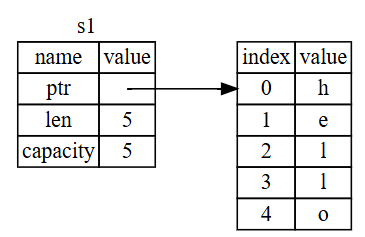
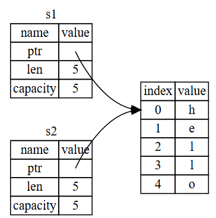
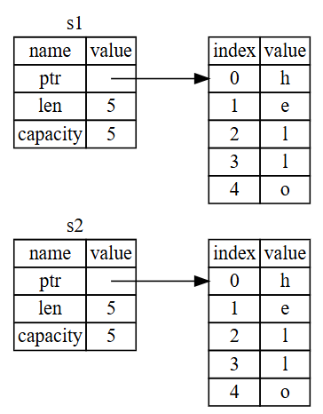
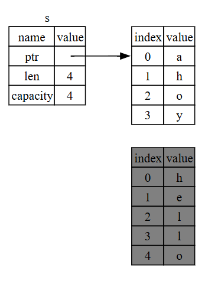
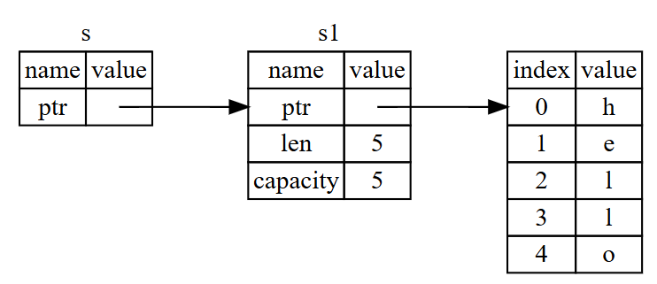
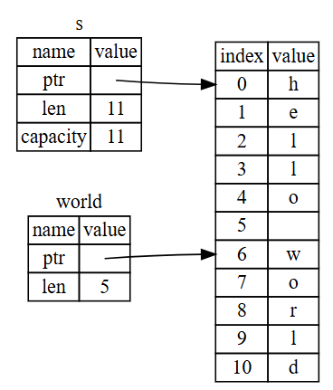

- Önceki derste Rust’ta stack ve heap kavramları arasındaki fark ile `String` ve `str` türleri arasındaki farka değindim. Aynı zamanda Rust’ın bellek güvenliği için ownership ve stack-heap konseptlerini kullandığını açıklamıştım.
- Bugün ise rust programlama dilinde `ownership`, `barrowing` ve `referanslar` ile `bellek güvenliğine` ve `slice` türüne  değineceğim.

# Ownership :

- Ownership Rust’ın en benzersiz özelliğidir ve dilin en önemli parçasıdır diyebiliriz.
- Rust bellek yönetimini güvenli hale getirmek için diğer dillerden farklı olarak;  çöp toplayıcı (Garbage Collector - GC) kullanmaz ve 
manuel bellek yönetimi gerektirmez (C/C++ gibi).
- **Rust** derleme zamanında kontrol edilen kurallarla çalışır.
    
    ## Ownership Kuralları :
    
    - Rust’ın programının belleğini nasıl yöneteceğini belirleyen üç temel kuralı vardır.
        1. Aynı anda yalnızca bir sahip (owner) olabilir.
        2. Rust'ta her değerin bir sahibi vardır.
        3. Sahip kapsam dışına çıktığında, değer otomatik olarak silinir (drop edilir).
    - Bu kurallardan herhangi biri ihlal edilirse, program derlenmez.
    - Ownership’in hiçbir özelliği, çalışırken programınızı yavaşlatmaz.
    
    ```rust
    fn main() {
        let s = String::from("hello");  // s bu String'in owner'ı olur
        takes_ownership(s);             // s'nin ownership'i fonksiyona geçer
        
        // println!("{}", s);           // Hata! Artık s'nin ownership'i yok
    }
    
    fn takes_ownership(some_string: String) {
        println!("{}", some_string);
    } // some_string scope'dan çıkar ve bellekten silinir
    ```
    

## Memory and Allocation (Bellek ve Tahsis) :

- Bellek, çalışma zamanında (runtime) bir bellek tahsis ediciden (memory allocator) talep edilmelidir.
- **`String`** türü, değiştirilebilir ve genişletilebilir bir metin için bellek ayırır. Bu bellek, **`String`** ile işimiz bittiğinde tahsis ediciye geri verilmelidir.
- Tahsis işlemi, **`String::from`** fonksiyonu çağrılarak gerçekleştirilir.
- Ancak bellek geri verme (deallocation) kısmı daha karmaşıktır. Çöp toplayıcı (garbage collector) olan dillerde bu konuyu düşünmemiz gerekmez, fakat çöp toplayıcı olmayan dillerde, belleğin artık kullanılmadığı anı tespit edip açıkça serbest bırakmak programcının sorumluluğundadır (tıpkı tahsis ederken olduğu gibi).
    
    Belleği serbest bırakma işleminde yapılan hatalar çeşitli sorunlara yol açabilir:
    
    - Belleği serbest bırakmayı unutmak, bellek sızıntısına (memory leak) neden olur.
    - Çok erken serbest bırakmak, geçersiz (invalid) bir değişkenle çalışmaya sebep olabilir.
    - Aynı belleği iki kez serbest bırakmak da bir hatadır. Her tahsis işlemi, **tam olarak bir** serbest bırakma ile eşleşmelidir.
- Rust, bu sorunun üstesinden farklı bir yaklaşımla gelir: Değişkenler kapsam (scope) dışına çıktığında, otomatik olarak bellekleri serbest bırakılır. Bu, **`Drop`** trait'i sayesinde gerçekleşir ve programcıya güvenli ve hatasız bellek yönetimi sağlar.

```rust
{
    let s = String::from("hello"); // s bu noktadan itibaren geçerlidir
}// bu scope artık bitti ve s artık yok
```

***💡 Not: Yukarıda görüldüğü gibi kapsamlar arasındaki ilişki ve değişkenlerin geçerli olduğu zaman diğer programlama dillerindeki ilişkiye benzerdir. s değişkeni kapsama girdiğinde geçerlidir ve kapsam dışına çıkana kadar geçerliliğini korur.***

- Rust, kapsamın sonundaki kıvırcık parantez (**`}`**) içinde **`drop`**'u otomatik olarak çalıştırır.
- Drop fonksiyonu, C++ programlama dilinde bir nesnenin ömrünün sonunda kaynakları otomatik olarak serbest bırakan **"Resource Acquisition Is Initialization" RAII (Kaynak Edinimi Başlatma)** modeline benzer bir çalışma modeli sunar.
- Bu yaklaşım, Rust programlarının yapısını derinden etkiler. Şu an basit görünse de, **birden fazla değişkenin aynı heap verisini kullanması gerektiğinde**, durum daha karmaşık hale gelebilir ve kodun davranışı beklenmedik sonuçlar doğurabilir. Şimdi bu tür senaryolardan bazılarını inceleyelim.

Önceki derslerde String türünden ve Primitive veri türlerinden bahsetmiştim. Primitive veri türleri bir boyutta, stack’te depolanabilir ve kapsamları dolduğunda stack’ten çıkarılabilir ve kodun başka bir bölümünün farklı bir kapsamda aynı değeri kullanması gerekirse yeni, bağımsız bir örnek oluşturmak için hızlı ve kolay bir şekilde kopyalanabilir. Ancak heap’te depolanan verilere bakmak ve Rust’ın bu verileri ne zaman temizleyeceğini nasıl bildiğini keşfetmek için String türü harika bir örnektir. String türü değiştirilebilirdir.

Dize sabitinden bir String oluşturmak için from işlemini kullanabiliriz.

### **Değişkenlerin Verilerle Etkileşimi :** Move Semantiği

- Rust’ta birden fazla değişken aynı verilerle farklı şekilde etkileşime girebilir.

**Örnek:**

```rust
 let x = 5;
 let y = x;
```

*5 değerini x'e atar, sonra x'in değerinin bir kopyasını oluşturup y'ye atar. Sonuçta iki değişkenimiz olur. x ve y değişkenlerinin her ikisi de 5 değerine sahiptir. Bu iki 5 değeri stack’te saklanır.*

- **Aynı örneği String tür için yaparsak;**
    
    **Örnek:**
    
    ```rust
    let s1 = String::from("hello");
    let s2 = s1;
    println!("{}", s1); // borrow of moved value hatasını verir
    ```
    
    - *Bu kod yukardaki integer örneğine benzese de çalışma şekli çok farklıdır. İlk bakışta ikinci satırın s1'deki değerin bir kopyasını oluşturup s2'ye atadığını düşünebiliriz, ancak gerçekte olan bu değildir.*
    - *String türü heap’te tutulduğu için davranışı primitive türlerden farklıdır.*
    - *Rust'ta `String` gibi heap’te veri tutan tiplerde atama (`=`) operatörü default olarak **move semantiği** uygular.*
    - *O yüzden `s1`'in sahip olduğu heap verisinin sahipliği `s2`'ye **taşınır**. Verinin kendisi heap’te kopyalanmaz.*

**String Türünün Bellek Yapısı :**

 **`String`** üç temel meta veriden oluşur ve bunlar stack’te saklanır :

1. **Pointer** : String içeriğinin depolandığı "hello" verisinin başlangıç adresini gösteren işaretçi
2. **Length**: String'in şu anda kullandığı bellek miktarı (byte cinsinden)
3. **Capacity**: String'in tahsis edilen toplam bellek miktarı
    
    Heap’te saklanan veri ise → **`index 0-4`**: "h", "e", "l", "l", "o" karakterleri.
    

*Aşağıdaki tablo `let s1 = String::from("hello");` kodunu yani `s1`verisinin tahsis edilmesini temsil eder.*



Aşağıdaki tablo ise kodun **`*s1`**'i **`s2`**'ye atama kısmı tablo halinde gösterilmiştir.*



- **`let s2 = s1`** işlemi ile **`s1`**'in stack'teki meta verileri (**`ptr`**, **`len`**, **`capacity`**) byte-by-byte **`s2`**'ye kopyalanır. Sonuç olarak hem **`s1`** hem de **`s2`** aynı heap verisini işaret eder.
- Rust, bu işlemden sonra **`s1`**'i **geçersiz** (invalid) olarak işaretler.
- Bellek güvenliğini sağlamak için Rust, Artık **`s1`** kullanılamaz. Bunun sebebi, çift serbest bırakma (double free) hatasını önlemek.
- Aynı zaamanda yukarıda tek sahiplik kuralı da uygulanır. Heap verisinin sahipliği (**`ptr`**) yalnızca **`s2`**'ye geçer. **`s1`** kapsam dışına çıksa bile **`drop`** çağrılmaz.
- `s1`geçersiz olduğu için de yukarıda s1’in çıktısını almaya çalıştığımızda  "borrow of moved value” hatası alırız.
- Burada kritik bir nokta vardır. Teknik olarak çok kısa bir süre için iki pointer aynı yeri gösterir ancak Rust’taki ownership kuralları bunu derleme zamanında kontrol eder ve hiçbir zaman runtime’da bu durumla karşılaşılmaz çünkü rust derleyicisi, move işlemi sonrasında **`s1`**'e erişimi tamamen engeller.
- Bu sorun asla güvenlik sorununa yol açmaz çünkü **`s1`** artık kullanılamaz ve **`drop`** mekanizması yalnızca **`s2`** için çalışacaktır.

**Eğer heap verisi de kopyalansaydı :** 

- Rust’ın çalışma mantığına göre s1 verisini s2’ye atadığımızda heap verisi de kopyalanmış olsaydı tablo aşağıdaki gibi görünürdü.
- Bu durum, runtime performansı açısından çok maliyetli olabilir.
    
    
    

- Tablonun bu davranışı, Rust'ın performans optimizasyonunu (heap kopyalamama) ve güvenlik önlemini (move) görmezden geliyor.
- s2 ve s1 kapsam dışına çıktığında aynı belleği boşaltmaya çalışır bu da çift serbest bırakma hatasına yol açar.
- Yukarıda her string için **ayrı ayrı** heap bellek blokları oluşturulmuş ve her ikisi de **"hello" verisini içeriyor.**
- Her iki **`String`** de kendi **`ptr`**, **`len`**, ve **`capacity`** değerlerine sahip.
    
    ```rust
     let s1 = String::from("hello");
        let s2 = s1;
    
        println!("{s1}, world!");
    ```
    
    Rust geçersiz kılınan referansı kullanmanızı engellediği için şu şekilde bir hata alırsınız:
    
    ```powershell
    error[E0382]: borrow of moved value: `s1`
     --> src\main.rs:6:15
      |
    3 |     let s1 = String::from("hello");
      |         -- move occurs because `s1` has type `String`, which does not implement the `Copy` trait
    4 |     let s2 = s1;
      |              -- value moved here
    5 |
    6 |     println!("{s1}, world!");
      |               ^^^^ value borrowed here after move
      |
      = note: this error originates in the macro `$crate::format_args_nl` which comes from the expansion of the macro `println` (in Nightly builds, run with -Z macro-backtrace for more info)
    help: consider cloning the value if the performance cost is acceptable
      |
    4 |     let s2 = s1.clone();
      |                ++++++++
    ```
    
    ***💡 Not:***  Bu hata, bir değerin taşındıktan sonra kullanılmaya çalışıldığını gösteriyor. **`println!`** makrosu **`s1`**'i kullanmaya çalışıyor, ancak **`s1`** artık bu değerin sahibi değil. Çözüm önerisi olarak `clone()`kullanmayı öneriyor.
    
- Rust dili **`*let s2 = s1*`** işleminde yukarıdaki gibi bir davranış sergilemez ancak `clone()` fonksiyonunun kullanımında bu davranışı sergileyebilir. Bu davranışa derin kopyalama (deep copy) denir.
- Bu davranışın bellek maliyeti yüksektir.
    
    ```rust
    let s1 = String::from("hello");
    let s2 = s1.clone()
    ```
    
    - **`s1` için**:
        - **Stack**: **`ptr`** (heap1 adresi), **`len: 5`**, **`capacity: 5`**
        - **Heap1**: **`['h', 'e', 'l', 'l', 'o']`**
    - **`s2` için**:
        - **Stack**: **`ptr`** (heap2 adresi), **`len: 5`**, **`capacity: 5`**
        - **Heap2**: **`['h', 'e', 'l', 'l', 'o']`**
        
    
    **`clone()` Nerede Kullanılmalı :**
    
    - Gerçekten verinin bir kopyası gerektiğinde.
    - Ownership transferi istemediğimizde.
    - Orijinal veriyi korumamız gerektiğinde.
    - **`String`** gibi kompleks tipler **`clone()`** gerektirir.
    - Basit tipler (integer, bool gibi) otomatik **`Copy`** trait'ine sahiptir, clone'a gerek yoktur.

***💡 Not:***  

- Diğer dillerdeki shallow copy terimi; Rust’taki verileri kopyalamadan pointer, length ve capacity kopyalamaya benziyor. Ancak rust ilk değişkeni geçersiz kıldığı için yüzeysel kopya (shallow copy) olarak adlandırmak yerine taşıma (move) olarak bilinir.
- Rust’ta asla deep copy otomatik oluşturmaz bu nedenle, herhangi bir otomatik kopyalama runtime performansı açısında ucuz varsayılabilir.

Rust'ta Değişkenlere Yeni Değer Atama :

```rust
let mut s = String::from("hello"); 
s = String::from("ahoy");          
println!("{s}, world!");  // Çıktı : "ahoy world!"
```

- Yukarıdaki kodda, Heap’te "hello" için bellek ayırılır **`s`** değişkeni bu bellek alanının sahibi (owner) olur daha sonra heap'te “ahoy” değeri için yeni bir bellek alanı ayırır eski bellek alanı serbest bırakılır **`s`** artık yeni "ahoy" değerinin sahibi olur. Aşağıda bu durumu gösteren tablo yer alıyor.



### **Copy Trait'i ve Stack Veriler :**

- Stack'te Saklanan Veriler derleme zamanında boyutu bilinen tiplerdir (integer, bool, char gibi).
- Copy Trait’i ise bu tiplerin otomatik olarak kopyalanabilmesini sağlayan özel bir işaretleyicidir.

```rust
let x = 5;    // i32 (Copy trait'ine sahip)
let y = x;    // Otomatik kopyalama - move semantics uygulanmaz

println!("x = {}, y = {}", x, y); // İkisi de geçerli
```

**Copy Tipler :**

- Tüm integer tipleri (i32, u64 vb.), Boolean (bool), Floating-point (f64 vb.), char, yalnızca Copy tipleri içeren tuple'lar.
- **`Drop`** trait'i implemente eden tipler **`Copy`** olamaz.
- Heap tahsisi gerektiren tipler (String, Vec gibi) **`Copy`** olamaz.
- Performans olarak Stack verilerinin kopyalanması çok hızlıdır ve ek bir maliyet olmadığı için varsayılan davranış olarak güvende kullanılabilir.

**Drop ve Copy İlişkisi :** 

- Bir tip hem **`Drop`** hem de **`Copy`** trait'lerini aynı anda implemente edemez.
- **`Copy`** tipler basit bit-bit kopyalama yaparken, **`Drop`** karmaşık temizlik mantığı gerektirir.
- Eğer bir tip **`Drop`** implemente ediyorsa ve **`Copy`** eklemeye çalışırsanız hata alırsınız.

## Fonksiyonlarda Ownership

- Rust'ta bir değeri bir fonksiyona aktarma mekaniği, bir değişkene değer atama mekaniğine benzer.
- Bir değişkeni fonksiyona aktarmak, tıpkı atama işleminde olduğu gibi, sahipliği **taşıyacak (move)** veya **kopyalayacaktır (copy)**.
    
    ```rust
    fn main() {
        let s = String::from("hello");
        takes_ownership(s);
    } 
    
    fn takes_ownership(some_string: String) {
        println!("{some_string}");
    }
    ```
    
    - String türündeki s değişkeni takes_ownership fonksiyonuna aktarıldığında, s'in değeri (ve sahipliği) fonksiyona geçer. Bu nedenle, s artık main fonksiyonunda geçerli değildir ve kullanılamaz.
    - Fonksiyon içinde (takes_ownership'ta some_string olarak), String kapsam dışına çıktığında drop fonksiyonu çağrılır ve bellek serbest bırakılır.
    
    ```rust
    fn main() {
        let x = 5;
        makes_copy(x);
        println!("{}", x);             
    
    }
    
    fn makes_copy(some_integer: i32) {
        println!("{some_integer}");
    }
    ```
    
    - i32 türündeki x değişkeni makes_copy fonksiyonuna aktarılır. i32 gibi basit türler Copy özelliğine (trait) sahip olduğu için, değerleri taşınmak yerine kopyalanır.
    - Bu yüzden x, fonksiyona aktarıldıktan sonra bile main fonksiyonunda kullanılmaya devam edilebilir.

### **Geri Dönüş Değerleri ve Kapsam :**

- Bir değeri fonksiyona geçirirseniz, sahiplik **fonksiyona taşınır**. Fonksiyondan geri döndürmezseniz, değer kaybolur.
- Örneğin aşağıda geri dönüş değeri olmayan fonksiyondaki String değerinin sahipliği fonksiyon kapsamından çıktıktan sonra  drop fonksiyonu ile temizlenir ve bellek serbest bırakılır.
- **Benzetme:** Kitabı kütüphaneye ödünç verirseniz, geri alana kadar sizde yoktur!
    
    ```rust
    fn kitabi_ver(k: String) { // Sahiplik FONKSIYONA geçti
        println!("Kitap: {}", k);
    } // `k` kapsamdan çıkar, bellek temizlenir!
    
    fn main() {
        let kitap = String::from("Rust 101");
        kitabi_ver(kitap); // Sahiplik FONKSIYONA taşındı
        println!("{}", kitap); // HATA! `kitap` artık yok.
    }
    ```
    
    Terminalden aşağıdaki gibi bir hata alırız : 
    
    ```powershell
    error[E0382]: borrow of moved value: `kitap`
    ```
    
- Bu hatayı çözmek için sahipliği geri almalıyız.
- Aşağıdaki örnekte olduğu gibi, fonksiyon değeri geri döndürürse, sahipliği tekrar alabiliriz :
    
    ```rust
    fn kitabi_odunc_al(k: String) -> String { // String'i geri döndürüyoruz
        println!("Okunuyor: {}", k);
        k // Sahipliği main'e geri veriyoruz
    }
    
    fn main() {
        let kitap = String::from("Rust 101");
        let kitap = kitabi_odunc_al(kitap); // Sahipliği geri aldık
        println!("Kitap geri alındı: {}", kitap); // Çalışır!
    }
    ```
    

- Bu sahiplik mekanizması çalışsa da, bir değeri bir fonksiyona verip (sahipliğini aktarıp) sonra tekrar kullanabilmek için fonksiyondan geri almak (sahipliğini geri almak) **zahmetli** olabilir.
- Özellikle bir fonksiyonun bir değeri yalnızca **kullanmasını** ama sahipliğini **almasını istemediğimiz** durumlarda bu durum can sıkıcıdır. Çünkü hem fonksiyonun ürettiği yeni verileri hem de tekrar kullanmak istediğimiz orijinal veriyi geri döndürmek gerekir.
- Rust, bu soruna kısmi bir çözüm olarak, bir **tuple** kullanarak birden fazla değer döndürmeye olanak tanır.
- Bu sayede, hem orijinal veri (sahipliği geri verilerek) hem de fonksiyonun hesapladığı ek bilgiler aynı anda döndürülebilir.

## **Tuple ile Çoklu Değer Döndürme :**

- Fonksiyon birden fazla değer döndürmek isterse, **tuple** kullanabiliriz.
- **Benzetme:** Kitabı ve bir notu birlikte geri vermek gibi.
    
    ```rust
    fn kitap_incele(k: String) -> (String, usize) {
        let uzunluk = k.len();
        (k, uzunluk) // Kitap ve uzunluğu tuple olarak döndür
    }
    
    fn main() {
        let kitap = String::from("Rust 101");
        let (kitap, uzunluk) = kitap_incele(kitap); // Tuple'ı parçala
        println!("Kitap: {}, {} sayfa", kitap, uzunluk);
    }
    ```
    

- Yukarıdaki tuple yöntemi de zahmetli bir yöntem. Rust'ın referanslar adı verilen, mülkiyeti devretmeden değeri kullanma özelliği ile yukarıdaki işlemi kolaylıkla yapabiliriz.
- **Benzetme:** Kitabı fotokopiyle paylaşmak gibi. Aslını vermiyorsunuz, kopyasını kullanıyorlar.

# Referans ve Borrowing :

- Önceki örnekteki tuple yaklaşımının temel sorunu, String'in kitap_incele fonksiyonuna taşınmasıydı. Bu nedenle, String'i main fonksiyonda tekrar kullanabilmek için fonksiyondan geri döndürmek gerekiyordu.
- Bunun yerine, String değerine bir referans sağlayabiliriz. Referans, o adreste depolanan verilere erişmek için takip edebileceğimiz bir adres olması bakımından bir pointer gibi çalışır.
- Bir pointer’ın aksine, bir referansın, ömrü boyunca belirli bir türdeki geçerli bir değere işaret etmesi garanti edilir. Bu, Rust'ın güvenlik özelliklerinden biridir.
- Kısacası, bir değere referans vermek, o değeri **sahipliğini almadan** kullanmamıza olanak tanır. Bu, değeri fonksiyona geçirip sonra geri alma zahmetini ortadan kaldırır.
    
    *Örnek Referans Kullanımı :* 
    
    ```rust
    fn uzunluk_hesapla(s: &String) -> usize { // `&` ile referans alıyoruz
        s.len() // Sahiplik HALA main'de!
    }
    
    fn main() {
        let s1 = String::from("hello");
        let uzunluk = uzunluk_hesapla(&s1); // Referansı gönderdik
        println!("'{}' {} harfli", s1, uzunluk); // `s1` hala geçerli!
    }
    ```
    
    - *&s1 syntax’ı, s1 değerine başvuran ancak ona sahip olmayan bir referans oluşturmamızı sağlar. Referans ona sahip olmadığından, referans kullanılmayı bıraktığında işaret ettiği değer düşürülmeyecektir.*
    - Benzer şekilde, fonksiyonun imzası, s parametresinin türünün bir referans olduğunu belirtmek için & kullanır.
    - Fonksiyonlar gerçek değerler yerine parametre olarak referanslara sahip olduğunda, owenership’İ geri vermek için değerleri döndürmemize gerek kalmaz.
    
    ***💡 Not:***   **`*&String`**: "Bu String'in sahipliğini alma, sadece ödünç al (borrow)" demek. Yani  referans oluşturma eylemine ödünç alma adını veriyoruz.*
    
- Yukarıdaki örnekteki referans kullanımını tablo olarak aşağıdaki gibi gösterebiliriz :
    
    
    

***💡 Not:***   & kullanarak referanslamanın tersi, * dereferans operatörüyle gerçekleştirilen dereferanslamadır. Dereferans operatörüne daha sonra değineceğim. 

- Referanslar varsayılan olarak değiştirilemezdir (immutable).
    
    ```rust
    fn main() {
        let s = String::from("hello");
    
        change(&s); // s'e değiştirilemez bir referans geçiyoruz
    }
    
    fn change(some_string: &String) {
        // Bu satır HATA verir!
        some_string.push_str(", world"); // Değiştirilemez referans üzerinden değeri değiştirmeye çalışıyoruz
    }
    ```
    
    Bu kod çalıştırıldığında terminalde aşağıdaki hatayı verir.
    
    ```powershell
    error[E0596]: cannot borrow `*some_string` as mutable, as it is behind a `&` reference
     --> src\main.rs:9:5
      |
    9 |     some_string.push_str(", world"); // Değiştirilemez referans üzerinden değeri değiştirmeye çalışıyoruz
      |     ^^^^^^^^^^^ `some_string` is a `&` reference, so the data it refers to cannot be borrowed as mutable
      |
    help: consider changing this to be a mutable reference
      |
    help: consider changing this to be a mutable reference
      |
    7 | fn change(some_string: &mut String) {
      |                         +++
    ```
    

## **Değiştirilebilir Referanslar (Mutable References) :**

- Bu sorunu çözmek ve ödünç aldığımız bir değeri değiştirebilmek için **değiştirilebilir referansları (&mut)** kullanırız.
    
    ```rust
    fn main() {
        let mut s = String::from("hello"); // 1. s'i `mut` (değiştirilebilir) yaptık
    
        change(&mut s); // 2. s'e değiştirilebilir bir referans (&mut s) geçtik
        println!("{s}"); // Çıktı: hello, world
    }
    
    fn change(some_string: &mut String) { // 3. Fonksiyon değiştirilebilir bir referans (&mut String) kabul ediyor
        some_string.push_str(", world");
    }
    ```
    
    - Bu değişikliklerle kod başarıyla derlenir ve s'in değeri "hello, world" olarak değişir. &mut kullanımı, change fonksiyonunun ödünç aldığı değeri değiştireceğini açıkça belirtir.
    
    ### **Değiştirilebilir Referansların Önemli Kısıtlamaları:**
    
    1. **Aynı Anda Sadece Bir Tane Değiştirilebilir Referans:** 
    - Bir değere, herhangi bir zamanda sadece bir tane değiştirilebilir referansınız (&mut) olabilir. Aynı anda aynı veriye birden fazla değiştirilebilir referans oluşturmaya çalışmak derleme hatasına yol açar:
        
        ```rust
        // Bu kod DERLENMEZ!
        fn main() {
            let mut s = String::from("hello");
        
            let r1 = &mut s; // İlk değiştirilebilir ödünç alma burada gerçekleşir
            let r2 = &mut s; // HATA! İkinci değiştirilebilir ödünç alma burada gerçekleşir
        
            println!("{}, {}", r1, r2); // İlk ödünç alma daha sonra burada kullanılır
        }
        ```
        
        Yukarıdaki kod, terminalde aşağıdaki hatayı döndürür.
        
        ```powershell
        error[E0499]: cannot borrow `s` as mutable more than once at a time
         --> src\main.rs:6:14
          |
        5 |     let r1 = &mut s;
          |              ------ first mutable borrow occurs here
        6 |     let r2 = &mut s;
          |              ^^^^^^ second mutable borrow occurs here
        7 |
        8 |     println!("{}, {}", r1, r2);
          |                        -- first borrow later used here
        ```
        
        Bu kısıtlama, Rust'ın derleme zamanında **veri yarışlarını (data races)** önlemesini sağlar. Veri yarışı şu üç koşul oluştuğunda meydana gelir:
        
        - İki veya daha fazla işaretçi aynı anda aynı veriye erişir.
        - İşaretçilerden en az biri veriyi yazmak için kullanılır.
        - Veriye erişimi senkronize etmek için bir mekanizma yoktur.
            
            Veri yarışları tanımsız davranışlara neden olur ve runtime’da ayıklanması zordur. Rust, veri yarışları olan kodu derlemeyi reddederek bu sorunu engeller.
            
    - Farklı kapsamlarda ardışık olarak birden fazla değiştirilebilir referans oluşturabilirsiniz, ancak aynı anda değil.
        
        ```rust
        let mut s = String::from("hello");
        {
            let r1 = &mut s;
            // r1 burada bir şeyler yapar
        } // r1 burada kapsam dışı kalır, s tekrar ödünç alınabilir
        
        let r2 = &mut s; // Sorun yok
        ```
        
    1. **Değiştirilebilir ve Değiştirilemez Referansları Karıştırma:** 
    - Bir değere **değiştirilemez referanslarınız (&) varken, aynı değere değiştirilebilir bir referans (&mut) oluşturamazsınız.**
        
        ```rust
        fn main() {
            let mut dosya = String::from("Merhaba Dünya!");
        
            let okuyucu1 = &dosya;       // 1. değiştirilemez referans
            let okuyucu2 = &dosya;       // 2. değiştirilemez referans
            let editör = &mut dosya;     // ⚠️ DEĞİŞTİRİLEBİLİR referans (HATA!)
        
            okuyucu1.len(); // Okuma işlemi
            editör.push_str(" Rust!");   // Değişiklik yapmaya çalışır
        }
        ```
        
        Terminalde aşağıdaki hata mesajını alırız : 
        
        ```powershell
        error[E0502]: cannot borrow `dosya` as mutable because it is also borrowed as immutable
        ```
        
        Doğru yaklaşım aşağıdaki gibi olmalıdır : 
        
        ```rust
        fn main() {
            let mut dosya = String::from("Merhaba Dünya!");
        
            // 1. Önce tüm okuma işlemleri
            let okuyucu1 = &dosya;
            let okuyucu2 = &dosya;
            println!("Okuyucu 1: {}", okuyucu1);
            println!("Okuyucu 2: {}", okuyucu2);
        		// okuyucu1 ve okuyucu2'nin kapsamı burada biter!
            // 2. Okuyucular işini bitirdikten sonra yazma işlemi
            let editör = &mut dosya;
            editör.push_str(" Rust!");
            println!("Düzenlenmiş: {}", editör);
        }
        ```
        
        Terminalde aşağıdaki çıktıyı alırız :
        
        ```powershell
        Okuyucu 1: Merhaba Dünya!
        Okuyucu 2: Merhaba Dünya!
        Düzenlenmiş: Merhaba Dünya! Rust!
        ```
        
        Bu kısıtlamanın sebepleri; 
        
        1. **Veri Yarışı (Data Race) Engelleme:**
            
            Aynı anda birisi veriyi okurken (**`&`**), diğeri yazarsa (**`&mut`**), tutarsızlık oluşur.
            
            - Örneğin: **`okuyucu1`** "Merhaba" yazısını okurken, **`editör`** aniden "Selam" yazarsa, **`okuyucu1`** eski veriyi görebilir.
        2. **Öngörülebilirlik:**
            
            Değiştirilemez referans kullanan kod, verinin *değişmeyeceğine* güvenebilir.
            
        3. **Güvenli Eşzamanlılık:**
            
            Bu kural, multithread ortamlarda da güvenliği sağlar (birden fazla thread aynı veriye erişse bile).
            

Sonuç olarak, rust bu kurallarla **derleme zamanında** bellek hatalarını engeller. Ödünç alma kontrolörü (borrow checker) kodu denetler.

## Dangling References (Sarkan Referanslar) :

- Dangling referans, bir verinin bellekteki konumuna işaret eden ama o verinin artık **geçerli olmadığı** (serbest bırakıldığı veya kapsam dışına çıktığı) bir referanstır.
- Bu, C/C++ gibi dillerde sık karşılaşılan bir bellek hatasıdır ve **tanımsız davranışa (undefined behavior)** yol açar.
- Rust derleyicisi (**borrow checker**), sarkan referans oluşmasını **derleme zamanında engeller**.
- Rust’ta bir referansın geçerli olabilmesi için, **işaret ettiği verinin, referanstan daha uzun ömürlü** olması gerekir.
- Eğer veri referanstan önce kapsam dışına çıkarsa, Rust **derleme hatası** verir.
    
    ```rust
    fn main() {
        let reference_to_nothing = dangle();
    }
    
    fn dangle() -> &String {
        let s = String::from("hello");
        &s
    }
    ```
    
    - Bu kod derlenmez çünkü `s` değişkeni `dangle` fonksiyonunun içinde tanımlanmıştır ve fonksiyon bittikten sonra belleği serbest bırakılır. Ancak bu değişkenin referansı döndürülmeye çalışılmıştır. Bu **geçersiz (dangling) bir referans** olurdu. Rust bunu derleme zamanında hata olarak bildirir. Aşağıda terminalde döndürülen hata :
        
        ```powershell
        5 | fn dangle() -> &String {
          |                ^ expected named lifetime parameter
          |
          = help: this function's return type contains a borrowed value, but there is no value for it to be borrowed from
        help: consider using the `'static` lifetime, but this is uncommon unless you're returning a borrowed value from a `const` or a `static`
         error[E0515]: cannot return reference to local variable `s`
         --> src\main.rs:7:5
          |
        7 |     &s
          |     ^^ returns a reference to data owned by the current function
        ```
        
    - Yani fonksiyonda tanımlanan bir değişkene ait referans dışarıya döndürülemez çünkü o değişken fonksiyon bitince yok olur.
    - En geçerli bir çözüm, referans döndürmek yerine **sahipliği** döndürmektir:
        
        ```rust
        fn no_dangle() -> String {
            let s = String::from("hello");
            s
        }
        ```
        
        ***💡 Not:***  *Burada `String` doğrudan döndürülüyor, böylece sahiplik (`ownership`) dışarı aktarılıyor ve veri geçerli kalıyor.*
        
    - Başka bir çözüm yöntemi de `lifetimes`kullanmaktır ama sadece referansın geçerli olduğu bir yaşam süresi varsa. Yani eğer referans verdiğimiz veri hâlâ dışarıda geçerli ise lifetimes kullanılabilir.
        
        ```rust
        fn get_first<'a>(s: &'a String) -> &'a str {
            &s[..1] // ✅ s yaşamaya devam ettiği sürece bu referans geçerlidir.
        }
        
        fn main() {
            let s = String::from("hello");
            let first = get_first(&s);
            println!("{}", first);
        }
        ```
        
        ***💡 Not:***  `*'a` lifetime parametresi, `s`'nin ve döndürülen referansın **aynı yaşam süresine** sahip olduğunu belirtir. `s` dışarıda (`main` içinde) tanımlandığı için, `get_first`'ten dönen referans geçerli olur.*
        
        **Hatalı Lifetime ile Referans Döndürmek :**
        
        ```rust
        fn invalid<'a>() -> &'a String {
            let s = String::from("hello");
            &s // HATA: s bu fonksiyonda tanımlandı ve yok edilecek.
        }
        ```
        
        *💡 **Not :** Bu kodda lifetime tanımlanmış gibi görünse de, `s` fonksiyon içinde yaratıldığı için ömrü kısa. Bu yüzden `&s` döndürülemez. Lifetimes referansın geçerli olmasını garanti etmez, sadece süresini tanımlar.*
        

### Referans Kurallarını Özetlersek :

- Aynı anda ya bir adet değiştirilebilir (mutable) referans ya da birden fazla değiştirilemez (immutable) referans olabilir.
- Referanslar her zaman **geçerli** olmalıdır (dangling olamazlar).

---

## Slice Type (Dilim Türü) :

- Dilimler, bir koleksiyonun tamamı yerine ardışık eleman dizilerine referans vermenizi sağlar.
- Bir tür referans olduğu için sahiplik (ownership) almazlar.

Slice türünü daha iyi kavramak için bir kitaptaki bir cümleyi işaret etmeyi düşünün:

- **İndeks yöntemi:** "3. sayfanın 5. satırı" dersiniz, sonra biri sayfaları değiştirirse kaybolursunuz.
- **Dilim yöntemi:** "Şu kırmızı çizgili cümle" dersiniz, kitap değişirse fark edersiniz

```rust
let s = String::from("merhaba dünya");

// İlk 3 karakter
let dilim1 = &s[0..3]; // "mer"

// 4. karakterden sonuna kadar
let dilim2 = &s[4..]; // "aba dünya"

// Tamamı
let dilim3 = &s[..]; // "merhaba dünya"
```

- Rust’ta bir veriye aynı anda hem **yazma hem okuma** izni verilmez. Slice’lar, yalnızca **okuma amaçlı** referanslar olduğu için aynı anda birden fazla slice oluşturulabilir.
- Böylece, hem veri üzerinde **eş zamanlı güvenli erişim** sağlanır hem de **çift serbest bırakma (double free)** gibi hatalar engellenmiş olur.

```rust
fn ilk_kelime(s: &str) -> &str {
    // Boşluk karakterini bulur ve oraya kadar olan kısmı döner
    if let Some(i) = s.find(' ') {
        &s[..i]
    } else {
        &s[..]
    }
}

fn main() {
    let cumle = String::from("merhaba dünya");
    let kelime = ilk_kelime(&cumle);

    println!("İlk kelime: {}", kelime); // "merhaba"
    
    // cumle.clear(); // Bu satırı açarsak hata verir çünkü kelime hâlâ cumle'ye referans veriyor
}
```

Terminaldeki çıktı : 

```powershell
İlk kelime: merhaba
```

- `ilk_kelime` fonksiyonu, verilen cümlenin ilk kelimesini slice olarak döner.
- Dönen değer `cumle` değişkenindeki veriye sadece bir referanstır, onu kopyalamaz.
- Eğer `cumle.clear()` satırını açarsak, Rust hata verir çünkü `kelime` hâlâ o veriye referans veriyor.Ödünç alma kurallarından hatırlayacağınız gibi, bir şeye değişmez bir referansımız varsa, aynı zamanda değişebilir bir referans alamayız. clear'ın String'i kesmesi gerektiğinden, değişebilir bir referans alması gerekir. clear çağrısından sonraki println! word'deki referansı kullanır, bu nedenle değişmez referans o noktada hala etkin olmalıdır. Rust, clear'daki değişebilir referansın ve kelime'deki değişmez referansın aynı anda var olmasına izin vermez ve derleme başarısız olur.
- Rust, burada derleme zamanındaki tüm bir hata sınıfını da ortadan kaldırmış oldu.

Bu kurallar sayesinde, Rust bize hem **performanslı** hem de **güvenli** bir şekilde dilimleme (slice) yapma imkânı verir. Kopyalama maliyeti olmadan veri üzerinde çalışabiliriz ve aynı zamanda bellek hatalarından korunmuş oluruz.

### Dize Dilimleri (String Slices) :

- Rust'ta **dize dilimi (string slice)**, bir `String`'in belli bir parçasına referans vermemizi sağlar.
- Bu sayede, veriyi kopyalamadan veya sahipliğini almadan, doğrudan orijinal `String` içindeki bir kısmı kullanabiliriz.
    
    ```rust
    let s = String::from("hello world");
    
    let hello = &s[0..5];  // "hello"
    let world = &s[6..11]; // "world"
    ```
    
    ***💡 Not:***  *Burada `hello`, `s` dizisinin 0. ile 5. baytları arasındaki kısmına referanstır. Rust’ın slice sözdizimi `[başlangıç..bitiş]` şeklindedir. Başlangıç dahil, bitiş hariç olacak şekilde çalışır.*
    
    Yukarıdaki kodun diyagramı : 
    
    
    
    ✅ Kısa Notlar:
    
    - `&s[0..2]` → s'nin ilk iki karakterine referans
    - `&s[..2]` → Aynı: 0'dan 2’ye kadar
    - `&s[3..]` → 3. karakterden sona kadar
    - `&s[..]` → Tüm String’e referans
    
    **Basitleştirilmiş Kurallar :** 
    
    1. **Başlangıç indeksi 0 ise atlanabilir :**
        
        ```rust
        let s = String::from("merhaba");
        
        // Aşağıdaki ikisi aynı:
        let dilim = &s[0..2]; // "me"
        let dilim = &s[..2];  // "me" (daha kısa yazım)
        ```
        
    2. **Son indeks stringin sonu ise atlanabilir :** 
        
        ```rust
        let s = String::from("merhaba");
        let uzunluk = s.len();
        
        // Aşağıdaki ikisi aynı:
        let dilim = &s[3..uzunluk]; // "haba"
        let dilim = &s[3..];        // "haba" (daha kısa yazım)
        ```
        
    3. **Tüm string dilimi için her iki indeks de atlanabilir :**
        
        ```rust
        let s = String::from("merhaba");
        
        // Aşağıdaki ikisi aynı:
        let dilim = &s[..];          // "merhaba"
        let dilim = &s[0..s.len()];  // "merhaba"
        ```
        
        **Uyarı :** Dilim sınırları **UTF-8 karakter sınırlarında** olmalıdır. Çok baytlı bir karakterin ortasından dilim almaya çalışırsanız program hata verir:
        
        ```rust
        let s = String::from("こんにちは"); // Japonca merhaba (her karakter 3 byte)
        // let dilim = &s[0..2]; // HATA! 3 baytlık karakterin ortası
        let dilim = &s[0..3]; // Doğru: "こ" karakterinin tamamı
        ```
        

### String Literals’de Slice Türü :

- String literalları (**"merhaba")** gibi) binary içinde saklanır ve aslında **&str** tipindedir:
    
    ```rust
       let s: &str = "Merhaba dünya!"; // s: &str (binary'deki bir noktaya işaret eden dilim)
    ```
    
    ***💡 Not:**  String literalları doğası gereği immutable'dır (değiştirilemez) çünkü `&str` immutable bir referanstır.*
    

**Fonksiyon Parametrelerinde Dilim Kullanımının Avantajları :**

- Rust’ta `&str`, hem `String` türünden hem de `"literal"`lerden türetilebilir. Bu yüzden `&str` alan bir fonksiyon hem `String` hem de `"metin"` gibi literal'lerle çalışabilir.
- **Esneklik:** Hem `String` hem de `"literal"` desteklenir.
- **Kod Tekrarı Azalır:** Farklı türler için ayrı fonksiyon yazmak gerekmez.
- **Performans:** `&str`, heap tahsisi yapmaz; daha hızlıdır.
- **İyi API Tasarımı:** Rust ekosisteminde bu bir *best practice*’tir.

Kötü Örnek: Sadece `String` ile çalışan fonksiyon  :

```rust
fn ilk_kelime(s: &String) -> &str {
    let bytes = s.as_bytes();
    for (i, &item) in bytes.iter().enumerate() {
        if item == b' ' {
            return &s[0..i];
        }
    }
    &s[..]
}
```

- Bu fonksiyon **yalnızca** `String` ile çalışır. `"merhaba dünya"` gibi bir literal gönderemezsin.

 
İyi Örnek: Hem `String` hem de `&str` ile çalışan fonksiyon :

```rust
fn ilk_kelime(s: &str) -> &str {
    let bytes = s.as_bytes();
    for (i, &item) in bytes.iter().enumerate() {
        if item == b' ' {
            return &s[0..i];
        }
    }
    &s[..]
}
```

- Bu haliyle hem `String` hem de `"literal"` gönderebilirsin:

Her ikisinin de kullanım örneği : 

```rust
fn main() {
    let string1 = String::from("merhaba dünya");
    let literal1 = "merhaba dünya"; // Bu zaten &str türündedir

    // ✅ String'in tamamını geçiyoruz
    println!("{}", ilk_kelime(&string1));       // merhaba
    println!("{}", ilk_kelime(&string1[..]));   // merhaba
    println!("{}", ilk_kelime(&string1[0..6])); // merhab

    // ✅ String literal kullanıyoruz
    println!("{}", ilk_kelime(literal1));       // merhaba
    println!("{}", ilk_kelime(&literal1[..]));  // merhaba
    println!("{}", ilk_kelime(&literal1[0..6])); // merhab
}
```

### 

## **Diğer Slice Türleri :**

- String dilimleri gibi array (dizi) dilimleri de vardır:

```rust
let dizi = [1, 2, 3, 4, 5];
let dilim = &dizi[1..3]; // &[i32] tipinde, [2, 3] değerinde

assert_eq!(dilim, &[2, 3]);
```

- Tipi **`&[i32]`** şeklindedir
- İlk eleman referansı ve uzunluk bilgisini tutar
- Vektörler gibi diğer koleksiyonlarda da benzer şekilde çalışır buna daha sonra değineceğim.

---

<< [Day 5](https://github.com/zeyneptass/30-Days-Of-Rust/blob/main/Rust_Tutorial_Day_5/RustDay5.md) | [Day 7](https://github.com/zeyneptass/30-Days-Of-Rust/blob/main/Rust_Tutorial_Day_7/RustDay7.md) >>